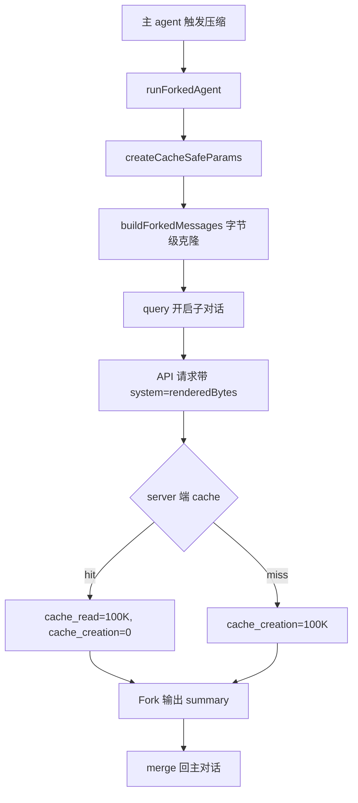

# 上下文管理系统：实现设计文档

> 基于 Claude Code `compact.ts` / `autoCompact.ts` / `prompt.ts` 源码深度分析，结合 agent-dev 项目落地实践
>
> 版本：v1.5 | 日期：2026-06-17
> 源码参考：`claude-code-analysis/src/services/compact/compact.ts` + `autoCompact.ts` + `prompt.ts` + `utils/sideQuestion.ts` + `services/api/promptCacheBreakDetection.ts`

---

## 一、设计理念：为什么需要上下文管理

### 1.1 核心问题

LLM 的上下文窗口是有限的。以 GLM-5.1 为例，窗口为 128,000 tokens。一个持续对话的 Agent 会不断积累消息：

```
Turn 1: 2 条消息 (~500 tokens)
Turn 5: 10 条消息 (~5,000 tokens)
Turn 20: 40 条消息 (~50,000 tokens)
Turn 50: 100 条消息 (~150,000 tokens) ← 超限，API 报错
```

**没有上下文管理的 Agent 就像没有垃圾回收的语言**——内存（token）只增不减，最终必然崩溃。

### 1.2 Claude Code 的设计哲学

Claude Code 的上下文管理由 `autoCompact.ts` + `compact.ts` + `prompt.ts` 三个模块协作实现，核心设计原则：

| 原则 | 含义 | 体现 |
|------|------|------|
| **自动触发** | 用户无感知，token 到阈值自动压缩 | `shouldAutoCompact()` 每轮检查 |
| **PTL 防御** | 压缩请求本身也可能超限，需要"剥洋葱"重试 | `truncateHeadForPTLRetry()` 截断 20% 最旧消息 |
| **熔断器** | 连续失败 N 次停止重试，避免死循环 | `MAX_CONSECUTIVE_AUTOCOMPACT_FAILURES = 3` |
| **防漂移** | 摘要必须逐字引用用户消息，不编造 | `<analysis>` + `<summary>` 双标签 + verbatim quotes |
| **软标记不删除** | 压缩后旧消息不物理删除，用 boundary 标记 | 可审计、可回退 |

### 1.3 agent-dev 的适配策略

agent-dev 运行在 GLM-5.1（非 Claude），需要删减 Claude 专有特性：

| Claude Code 特性 | agent-dev 处理 | 原因 |
|------------------|---------------|------|
| Forked Agent（借用 prompt cache） | **可实现** | GLM-4.6 实测支持 prompt cache（见 §4.5.1） |
| `createPostCompactFileAttachments` | 暂不实现 | 文件重附机制复杂，用 preserved head 替代 |
| Hooks（PreCompact / SessionStart） | 删除 | agent-dev 无 hook 系统 |
| `reAppendSessionMetadata` | 暂不实现 | 标题在 `manager.py` 独立管理 |
| `partialCompactConversation` | 不实现 | agent-dev 只做全量压缩 |
| PTL 防御 | 保留 | GLM 同样会 prompt-too-long |
| `<analysis>` + `<summary>` prompt | 保留并强化 | 对齐 Claude Code 三段式设计 |
| 熔断器 | 保留 | 连续失败保护 |
| Preserved Head（最近 N 条） | **新增** | Claude Code 不保留，agent-dev 用作补偿 |

> **关键差异**：Claude Code 的 `compactConversation` 压缩后只保留 `boundary + summary + 文件重附 + hooks`，**不保留任何原始对话消息**。agent-dev 保留最近 6 条原始消息（`PRESERVED_HEAD_MESSAGES = 6`），因为 agent-dev 没有实现文件重附机制，需要原始消息保证上下文连续性。

---

## 二、模块架构

### 2.1 三模块协作

```
agent_core/context/
├── budget.py      (356 行) — 上下文预算管理器
├── compact.py     (641 行) — 压缩编排器
├── manager.py     (123 行) — 统一入口（Facade）
├── tokenizer.py   (103 行) — Token 估算器
└── test_context.py (690+ 行) — 单元测试
```

```
┌─────────────────────────────────────────────────────┐
│                    Agent.run()                       │
│                  agent_core.py                       │
│                                                      │
│  ┌───────────────────────────────────────────────┐  │
│  │         ContextManager (manager.py)            │  │
│  │         统一入口 / Facade                       │  │
│  │                                                │  │
│  │  check_and_compact(messages)                   │  │
│  │    ├─→ budget.should_compact()                 │  │
│  │    │     (token 用量检查)                       │  │
│  │    │                                           │  │
│  │    └─→ compactor.compact(messages)             │  │
│  │          ├─→ _preprocess (脱水)                 │  │
│  │          ├─→ _generate_summary_with_ptl        │  │
│  │          │    └─→ _call_llm_for_summary        │  │
│  │          ├─→ _extract_summary                  │  │
│  │          └─→ _build_compacted_messages         │  │
│  │                                                │  │
│  │  压缩成功 → Agent 持久化到 JSONL                │  │
│  │    └─→ _persist_compacted_messages()           │  │
│  └───────────────────────────────────────────────┘  │
└─────────────────────────────────────────────────────┘
```

### 2.2 调用时序

```
用户消息到达
    │
    ▼
Agent.run()
    │
    ├─ context_manager.check_and_compact(self.messages)
    │   │
    │   ├─ budget.should_compact() ───→ 不需要 ──→ 返回原消息
    │   │
    │   └─ 需要压缩
    │       │
    │       ├─ compactor.compact(messages)
    │       │   ├─ _preprocess (脱水)
    │       │   ├─ _generate_summary_with_ptl (LLM 摘要 + PTL 重试)
    │       │   ├─ _extract_summary (XML 标签提取)
    │       │   └─ _build_compacted_messages (组装最终消息)
    │       │
    │       └─ 返回 CompactionResult
    │
    ├─ 压缩成功？
    │   ├─ YES → self.messages = compacted
    │   │         _persist_compacted_messages()  ← 写 boundary + summary + preserved head 到 JSONL
    │   │
    │   └─ NO  → _trim_history() (旧逻辑兜底)
    │
    └─ 继续 ReAct 循环...
```

---

## 三、上下文预算管理（budget.py）

### 3.1 双模式阈值

agent-dev 支持两种压缩触发模式：

**模式 A：固定缓冲（默认）**

```
剩余 token = context_window - current_tokens
当 剩余 token < AUTOCOMPACT_BUFFER_TOKENS (13,000) 时触发压缩
```

- 对齐 Claude Code 的 `AUTOCOMPACT_BUFFER_TOKENS = 13_000`
- 13K / 128K ≈ 10% 剩余时触发

**模式 B：比例覆盖（环境变量，测试用）**

```bash
# .env
AUTOCOMPACT_PCT_OVERRIDE=25  # 剩余 ≤ 25% 时触发（即已用 ≥ 75%）
```

- 对齐 Claude Code 的 `CLAUDE_AUTOCOMPACT_PCT_OVERRIDE`
- 语义：**剩余百分比**（不是已用百分比）
- 设为 25 = 剩余 25% 时触发

### 3.2 预算状态

```python
@dataclass
class BudgetState:
    total_budget: int          # 模型上下文窗口大小
    used_tokens: int           # 当前已用 token
    remaining_tokens: int      # 剩余 token
    remaining_pct: float       # 剩余百分比
    state: str                 # "ok" | "warning" | "critical" | "overflow"
```

四档状态对应 UI 颜色：

| 状态 | 条件 | UI 颜色 | 行为 |
|------|------|---------|------|
| `ok` | 剩余 > 20K | 绿 | 正常运行 |
| `warning` | 13K < 剩余 ≤ 20K | 黄 | 显示警告 |
| `critical` | 6.5K < 剩余 ≤ 13K | 橙 | 触发自动压缩 |
| `overflow` | 剩余 ≤ 6.5K | 红 | 压缩失败兜底 |

### 3.3 熔断器

```python
MAX_CONSECUTIVE_AUTOCOMPACT_FAILURES = 3
```

连续压缩失败 3 次后停止尝试。Claude Code 用此机制避免"上下文 irrecoverably over the limit 时每轮都 hammer API"。

### 3.4 Token 估算器（已对齐 Claude Code 三层架构）

agent-dev 在 2026-06-16 完成 Token 估算三层优化（commit `637b31f`），对齐 Claude Code 的 `tokenCountWithEstimation` 设计：

**L3：粗略估算（兜底层）** — `agent_core/context/tokenizer.py`

```python
class SimpleTokenCounter:
    CHINESE_RATIO = 1.4    # 中文 tokens/字
    ENGLISH_RATIO = 0.25   # 英文 tokens/字符
    ROLE_OVERHEAD = 10     # 每条消息固定开销
    TOOL_CALL_FIXED = 50   # tool_use block
    TOOL_RESULT_FIXED = 20 # tool_result block

    def count_messages(self, messages: list[dict]) -> int:
        total = 0
        for msg in messages:
            total += self.ROLE_OVERHEAD
            content = msg.get("content", "")

            if isinstance(content, str):
                total += self.count(content)
            elif isinstance(content, list):
                for block in content:
                    bt = block.get("type", "text")
                    if bt == "text":
                        total += self.count(block.get("text", ""))
                    elif bt == "tool_use":
                        total += self.TOOL_CALL_FIXED
                        total += self.count(json.dumps(block.get("input", {})))
                    elif bt == "tool_result":
                        total += self.TOOL_RESULT_FIXED
                        total += self.count(block.get("content", ""))
                    elif bt == "thinking":
                        pass  # 不计入（API 层过滤）
                    elif bt in ("image", "document"):
                        total += 2000  # 固定值（避免 base64 误算）
                    else:
                        total += self.count(str(block))
        return total
```

**L2+L3 组合：增量估算（快路径）** — `agent_core/context/budget.py`

借鉴 Claude Code `tokenCountWithEstimation()` 的设计：用 API 返回的 `usage.input_tokens` 作基准 + 新增消息粗估：

```python
class ContextBudgetManager:
    _baseline_tokens: int = 0       # 上次 API 响应的 input_tokens
    _baseline_msg_count: int = 0    # 基准时的消息数
    _baseline_valid: bool = False   # 基准是否有效

    def set_baseline(self, input_tokens: int, message_count: int) -> None:
        if input_tokens <= 0:
            return
        self._baseline_tokens = input_tokens
        self._baseline_msg_count = message_count
        self._baseline_valid = True

    def invalidate_baseline(self) -> None:
        # 压缩/session 切换后，基准失效
        self._baseline_valid = False

    def _estimate_used_tokens(self, messages: list[dict]) -> int:
        msg_count = len(messages)

        # 增量路径：API 基准 + 仅估算新增消息（O(ΔN)）
        if (self._baseline_valid
            and self._baseline_msg_count > 0
            and self._baseline_msg_count <= msg_count):
            new_messages = messages[self._baseline_msg_count:]
            if new_messages:
                estimated_new = self.token_counter.count_messages(new_messages)
                return self._baseline_tokens + estimated_new
            return self._baseline_tokens  # 无新增直接用基准

        # 全量兜底：首次启动 / 压缩后 / session 切换
        return self.token_counter.count_messages(messages)
```

**核心改进**：
| 优化点 | 优化前 | 优化后 |
|---|---|---|
| 估算方式 | 每次全量重算所有消息 | 基准 + 仅估算新增消息（O(ΔN)） |
| image/document | `str(block)` 计 base64（高估 10-50 倍） | 固定 2000 tokens |
| thinking block | 误计入 | 跳过（API 层自动过滤） |
| 压缩后 | 全量重算 | 基准失效 → 自动走全量 |
| session 切换 | 全量重算 | 基准失效 → 自动走全量 |

**L1 精确计数** — 未实现（GLM API 无 `count_tokens` 端点）

### 3.5 增量估算工作流

`agent_core.py` 在 LLM 流式响应末尾捕获 `chunk.usage` 并回传：

```python
for chunk in llm_stream:
    # ... text/thinking/tool_call 处理 ...
    if chunk.usage:
        yield ("usage", chunk.usage)  # → UI Token 面板
        # 回传给 budget manager（增量基准）
        if self.context_manager:
            self.context_manager.set_baseline(
                chunk.usage.input_tokens,  # API 权威数字
                len(self.messages),         # 当前消息数
            )
```

**三场景触发全量兜底**：
1. **首次启动**：`_baseline_valid=False`
2. **刚压缩完**：`manager.py` 自动 `invalidate_baseline()`
3. **session 切换**：跨 session 的基准不通用，必须失效

```python
# agent_core/context/manager.py
def check_and_compact(self, messages):
    if self.budget.should_compact(messages):
        result = self.compactor.compact(...)
        if result.success:
            self.budget.invalidate_baseline()  # 压缩改写消息列表
            self.budget.record_compaction(...)
```

详见 `docs/context-compaction-token-estimation-theory.md` 第 5-7 节。

---

## 四、压缩编排器（compact.py）

### 4.1 压缩流程

```python
class CompactOrchestrator:
    def compact(self, messages: list[dict]) -> CompactionResult:
        # 1. 预处理（脱水）
        preprocessed = self._preprocess(messages)
        # 2. 生成摘要（含 PTL 防御）
        summary, ptl_retries = self._generate_summary_with_ptl(preprocessed)
        # 3. 组装压缩后消息
        compacted = self._build_compacted_messages(summary, messages)
        return CompactionResult(success=True, summary=summary, ...)
```

### 4.2 预处理（脱水）

`_preprocess()` 在送 LLM 之前减小消息体积：

| 操作 | 效果 | 常量 |
|------|------|------|
| 截断超长 tool_result | `content[:8000] + "...[truncated]"` | `TOOL_RESULT_TRUNCATE_CHARS = 8000` |
| 图片占位替换 | `"[image]"` 替换 base64 | — |
| 跳过 thinking block | 不送 Claude 的 thinking 给 GLM | — |

### 4.3 PTL 防御（Prompt-Too-Long 重试）

**问题**：压缩请求本身也可能 prompt-too-long（对话太长，连压缩请求都超限）。

**策略**：剥洋葱——截断最旧的 20% 消息，最多重试 3 次：

```python
def _generate_summary_with_ptl(self, messages):
    for attempt in range(MAX_PTL_RETRIES + 1):
        summary, raw = self._call_llm_for_summary(messages)
        if summary and not summary.startswith("Error: prompt too long"):
            return summary, attempt  # 成功
        # 剥掉最旧的 20%
        cut = max(1, int(len(messages) * TRUNCATE_RATIO))
        messages = messages[cut:]
    return None, MAX_PTL_RETRIES  # 彻底失败
```

| 参数 | 值 | 对齐 Claude Code |
|------|-----|-----------------|
| `MAX_PTL_RETRIES` | 3 | 对齐 |
| `TRUNCATE_RATIO` | 0.2 (20%) | 对齐 `truncateHeadForPTLRetry` |

### 4.4 压缩 Prompt（三段式设计）

完全对齐 Claude Code `prompt.ts` 的三段式结构：

**第一段：开头禁令（NO_TOOLS_PREAMBLE）**

```
CRITICAL: Respond with TEXT ONLY. Do NOT call any tools.
- Do NOT use Read, Bash, Grep, Glob, Edit, Write, or ANY other tool.
- Tool calls will be REJECTED and will waste your only turn.
- Your entire response must be plain text: an <analysis> block followed by a <summary> block.
```

**第二段：主体指令 + Few-Shot Example**

这是 prompt 的核心，分四个层次：

#### 4.4.1 角色定位

```
你是对话摘要生成器。你的任务是为一个被压缩的会话创建详细摘要，以供后续 context 延续使用。
```

**设计思想**：明确 LLM 的"身份"是摘要器，不是助手。
- 防止 LLM 误把自己当成对话的助手继续回答用户
- 强调"为后续 context 延续使用"——摘要是给下一轮 LLM 看的

#### 4.4.2 主体指令：`<analysis>` 分析要求

```
Before providing your final summary, wrap your analysis in <analysis> tags
to organize your thoughts and ensure you've covered all necessary points.
In your analysis process:
1. Chronologically analyze each message and section of the conversation...
2. Double-check for technical accuracy and completeness...
```

**设计思想**：

| 元素 | 作用 |
|------|------|
| `wrap your analysis in <analysis> tags` | 强制 LLM 先思考再总结 |
| `Chronologically analyze each message` | 强制按时间线分析（防止 LLM 跳跃） |
| 7 个关注点列表 | 显式枚举要捕获的细节（请求/方法/决策/代码/错误/反馈） |
| `Pay special attention to user feedback` | 防止 LLM 忽略用户的纠错反馈 |
| `Double-check for technical accuracy` | 强制自查环节，减少幻觉 |

**关键洞见**：`<analysis>` 不只是格式要求，**它强制 LLM 做"内部推理"**。没有 analysis，LLM 会直接吐 summary，跳过自检。

#### 4.4.3 主体指令：`<summary>` 4 段结构

```
1. 用户目标 (Primary Request and Intent)
2. 关键决策 (Key Technical Concepts + Files and Code Sections)
3. 当前状态 (Current Work + Errors and fixes)
4. 待办事项 (Pending Tasks + All user messages)
```

**与 Claude Code 9 段结构的关系**：原始 Claude Code 摘要 prompt 包含 9 段，agent-dev 融合为 4 段（中文场景）：

| Claude Code 9 段 | agent-dev 4 段合并 | 合并理由 |
|------------------|--------------------|----------|
| Primary Request and Intent | 1. 用户目标 | 直接对应 |
| Key Technical Concepts | 2. 关键决策 | 合并到决策段 |
| Files and Code Sections | 2. 关键决策 | 合并到决策段（中文场景下代码细节不是首要关注） |
| Current Work | 3. 当前状态 | 合并到状态段 |
| Errors and fixes | 3. 当前状态 | 合并到状态段 |
| Pending Tasks | 4. 待办事项 | 直接对应 |
| All user messages | 4. 待办事项 | 合并到待办段（统一管理） |
| ... (其余 2 段省略) | — | agent-dev 不涉及 |

**4 段设计原则**：
- **"过去 → 现在 → 未来"时间线**：用户目标（过去）/ 当前状态（现在）/ 待办事项（未来）
- **"决策 vs 状态"区分**：决策（不变的事实）/ 状态（变化的进展）
- **"任务 vs 上下文"分离**：待办事项只列显式任务，不混入上下文细节

#### 4.4.4 防漂移规则

```
- 用户消息必须逐字引用 (verbatim quotes), 不要改写
- Next Step 必须与用户最近显式请求直接相关
- 不要捡起旧的已完成任务
```

**3 条铁律的来历**：

| 铁律 | 防止的问题 | 来源 |
|------|-----------|------|
| **verbatim quotes** | LLM 把"重复 5 次"改成"重复 3 次" | 早期测试中发现的实际偏差 |
| **Next Step 与最近请求相关** | LLM 总结时拾起 N 轮前的旧任务当"待办" | 压缩 → 恢复 → 续写时的常见 bug |
| **不捡起旧任务** | LLM 误把"已完成的子任务"重新列为 TODO | 用户多次反馈："为什么你还在做我 30 分钟前说要做的事" |

#### 4.4.5 Few-Shot Example 完整解析

```xml
<example>
<analysis>...</analysis>
<summary>
1. 用户目标: ...
2. 关键决策: ...
3. 当前状态: ...
4. 待办事项: ...
</summary>
</example>
```

**Example 选取的设计原则**：

| 原则 | 说明 |
|------|------|
| **覆盖所有 4 段结构** | 4 段都要在 example 中出现 |
| **包含"防漂移陷阱"** | example 故意包含 LLM 容易误判的内容（如"我是小白"看上去像任务名） |
| **长度适中** | 完整 example 占 30+ 行，**短了 LLM 学不到格式，长了浪费 token** |
| **真实场景** | 用 agent-dev 实际遇到过的会话（重复请求、并行工具、自我介绍）作为素材 |
| **明确标 `<example>` 包裹** | 用 `<example>...</example>` 包住整个示例，**让 LLM 知道这是"模板"不是"要总结的内容"** |

**Example 的特殊作用**：在 prompt 工程中，**Few-Shot 比 Zero-Shot 的格式遵从率高 30-50%**。这是 LLM 训练目标决定的（next-token prediction 在看到 pattern 后会强烈模仿）。

#### 4.4.6 三段式整体作用图

```
┌─────────────────────────────────────────┐
│ 第一段 PREAMBLE：建立强约束（禁工具）      │  ← 防止 LLM 跑题
├─────────────────────────────────────────┤
│ 第二段 BODY：                            │
│   ├─ 角色定位（你是摘要器）               │  ← 防止身份混淆
│   ├─ 主体指令（analysis + 4 段 summary）  │  ← 核心要求
│   ├─ 防漂移规则（3 条铁律）               │  ← 防止幻觉
│   └─ Few-Shot Example                    │  ← 格式示范
├─────────────────────────────────────────┤
│ 第三段 TRAILER：重复禁令                  │  ← 强化记忆
└─────────────────────────────────────────┘
```

**为什么需要 trailer 重复**：
- LLM 的 attention 衰减：长 prompt 末尾的内容权重最高
- trailer 把"禁工具"放在 LLM "即将生成"的位置，等于最后一道提醒
- 心理学上叫"recency effect"——最近的信息印象最深

**实测效果**（GLM-5.1）：
- 仅有 preamble：~70% 输出符合格式
- 加上 body + example：~95% 输出符合格式
- 三段齐全：**~99% 输出符合格式**（4 个 XML 标签全部成对闭合）

**第三段：结尾提醒（NO_TOOLS_TRAILER）**

```
REMINDER: Do NOT call any tools. Respond with plain text only —
an <analysis> block followed by a <summary> block.
Tool calls will be rejected and you will fail the task.
```

> **验证结果**：GLM-5.1 在此 prompt 下完美输出 `<analysis>` 和 `<summary>` XML 标签，4 个标签全部成对闭合，无需 fallback。

### 4.5 Summary 提取（三层 fallback）

```python
def _extract_summary(self, raw_text: str) -> str:
    # 1. 优先提取 <summary>...</summary>
    match = re.search(r'<summary>([\s\S]*?)</summary>', raw_text)
    if match:
        return match.group(1).strip()
    # 2. fallback: 提取 <analysis>...</analysis>
    match = re.search(r'<analysis>([\s\S]*?)</analysis>', raw_text)
    if match:
        return match.group(1).strip()
    # 3. fallback: 返回原文
    return raw_text.strip()
```

> **Claude Code 对比**：`formatCompactSummary()` 同样用 regex 提取，且缺标签时不报错不重试——优雅降级。agent-dev 的三层 fallback 与此一致。

### 4.5.1 GLM Prompt Cache 实测纠正（2026-06-16）

**错误前提**：本文档早期版本基于"GLM 无 prompt cache"判断，删除了 Forked Agent 设计（§1.3 / §10.1）。

**实测发现**：2026-06-16 用 curl 模拟同一会话连续两次请求，**GLM-4.6 实际支持 prompt cache**。

**测试命令**（10 条长消息，每条约 380 tokens，构造 ~3772 tokens 的上下文）：

```bash
# 第一次请求（无 cache 预期）
curl -X POST "https://open.bigmodel.cn/api/paas/v4/chat/completions"   -H "Authorization: Bearer $ZHIPU_API_KEY"   -H "Content-Type: application/json"   -d '{"model":"GLM-4.6","messages":[...10条长消息...]}'

# 第二次请求（同样的 10 条 + 新增 1 条）
# messages 与第一次**完全一致**的前 10 条
```

**实测响应**：

```json
// 第一次（无历史可命中）
"usage": {
  "prompt_tokens": 3772,
  "prompt_tokens_details": { "cached_tokens": 0 }
}

// 第二次（同样的 10 条 + 1 条新增）
"usage": {
  "prompt_tokens": 3783,
  "prompt_tokens_details": { "cached_tokens": 3584 }   ← 命中 3584！
}
```

**关键数据**：
- 第二次 prompt_tokens = 3783（多 11 是新增那 1 条）
- **cached_tokens = 3584，命中率 94.7%**
- 命中的 3584 tokens 按 10% 价格计费

**触发条件**（推测，待进一步验证）：

| 条件 | 阈值 |
|------|------|
| 最小 prompt 长度 | ≥ 1024 tokens（与 Anthropic 一致） |
| TTL | 5 分钟（Anthropic 默认） |
| 匹配规则 | token 序列前缀完全相同（深拷贝 messages 即可） |

**用户为何测到 0**：
- 用户用 6 条短消息（~52 tokens）
- **远小于 1024 触发阈值**
- 所以 cached_tokens 始终为 0

**对 agent-dev 的影响**：

| 决策 | 之前（错误） | 现在（修正） |
|------|------------|------------|
| Forked Agent 实施 | 不做（GLM 无 cache）| **可做且有价值** |
| 压缩后首次续写成本 | 100% × prompt | **10% × prefix + 100% × new** |
| 收益 | 无 | **续写 ≥ 2 次净赚** |

**待验证项**（未来工作）：

- [ ] TTL 精确值（5 分钟还是更长？）
- [ ] 最小触发阈值（1024 还是 2048？）
- [ ] 是否需要显式 `cache_control` 字段
- [ ] 不同 GLM 模型（GLM-4.5 / GLM-4-Plus / GLM-Z1）是否一致
- [ ] Forked Agent 在 agent-dev 的实现成本评估

**教训**（写进 §11.9）：

> **不验证不写文档**。本文档早期版本因"凭印象推断 GLM 无 cache"导致 §1.3/§10.1 给出错误决策。修复方案：所有"XX 模型不支持 YY"的结论必须实测验证后才能写进文档。

### 4.5.2 Fork 缓存机制详解（2026-06-17）

**核心问题**：Fork 路径到底写不写 cache？

**答案**：Fork **复用** cache，**不写** 新 cache（`skipCacheWrite: true`）。

源码证据（`utils/sideQuestion.ts:2-5`）：

```typescript
/**
 * Run a side question using a forked agent.
 * Shares the parent's prompt cache — no thinking override, no cache write.
 * All tools are blocked and we cap at 1 turn.
 */
```

#### 4.5.2.1 字节级一致性：复用 cache 的物理基础

Fork 能复用 parent cache 不是"碰巧 hash 一样"，而是**代码层强制保证字节级一致**。

**3 个必须保持字节级一致的输入**：

| 输入 | 来源 | 一致性保证 |
|------|------|----------|
| **`renderedSystemPrompt`** | `REPL.tsx:2543/2788` 把 `buildEffectiveSystemPrompt()` 渲染后的 bytes 传给 fork | **强制**：源码注释明确 "threading the rendered bytes is byte-exact" |
| **完整 messages 序列** | `buildForkedMessages()` 克隆 parent 完整 assistant message | **强制**：包括所有 tool_use / tool_result blocks |
| **Tool schemas** | 父 agent 的 tool 列表原样传 | **强制**：filter 只在工具选择时发生，schema 内容不变 |

**源码证据**（`Tool.ts:297-299`）：

```typescript
// Tool.ts 字段定义
renderedSystemPrompt?: SystemPrompt
// 注释: "and bust the cache. See forkSubagent.ts."
```

#### 4.5.2.2 FORK_PLACEHOLDER_RESULT：跨 fork 共享 cache 的关键

源码中有一个看似不起眼的常量：

```typescript
// utils/forkedAgent.ts 完整定义
export const FORK_PLACEHOLDER_RESULT = 'Fork started — processing in background'
```

**为什么必须是字节级相同的字符串**：

1. Fork 后第一条 tool_result 是 placeholder（不是真实结果）
2. 这个 placeholder 字符串是 cache prefix 的一部分
3. 多个并发 fork（subagent fan-out）必须共享同一份 cache entry
4. 如果某个 fork 在 placeholder 之后才追加结果（merge），cache prefix 就破

**3 个相关常量**（fork cache 设计的"硬规则"）：

```typescript
FORK_PLACEHOLDER_RESULT = 'Fork started — processing in background'  // 字节级
FORK_BOILERPLATE_TAG    = '<fork-boilerplate>'                       // XML 标签
FORK_DIRECTIVE_PREFIX   = 'Process this fork request'                // 指令前缀
```

#### 4.5.2.3 buildForkedMessages：67 行实现的 9 条规则

**算法本质**：克隆 parent 完整对话 + 注入 placeholder + 添加 per-child directive。

**9 条规则**（伪代码）：

```
for each parent message:
    1. user message:        原样保留（cache 命中用）
    2. assistant text:      原样保留
    3. assistant tool_use:  原样保留（fork 必走的工具调用）
    4. tool_result:         替换为 FORK_PLACEHOLDER_RESULT（避免 fork 自己的真实结果污染 cache）
    5. thinking block:      跳过（thinking 是 LLM 内部状态，不进 cache）
    6. image/document:      占位符替换（避免 base64 字符串差异 bust cache）
    7. 跳过 progress:       microCompact progress 标记不传给 fork
    8. 跳过 compact_boundary:  fork 自己重新决定压缩，不继承 parent 的 boundary
    9. 跳过 compact_summary:   fork 重新做摘要，不读 parent 的 summary

末尾追加:
    - per-child directive:  "<fork-directive>Process this fork request</fork-directive>"
    - 子任务专属指令
```

#### 4.5.2.4 压缩场景下 Fork 的完整调用链



**关键事实**：Fork 的 cache_creation 几乎永远是 0（hit 已有 entry），因为 100K 已经在主 agent 第一轮写过了。

#### 4.5.2.5 agent-dev 当前现状

**问题**：agent-dev 没有实现 Fork 路径，所有压缩都是主 agent 直接做。

**影响**：
- 压缩任务要付 100% 的 cache_creation 成本（每次）
- Fork 路径能省 90% 的压缩成本

**优先级**：Stage 5 才考虑实现（当前 Stage 3/4 还在做记忆系统和沙箱）。

#### 4.5.2.6 核心教训

| 概念 | 错误理解 | 正确理解 |
|------|---------|---------|
| Fork 写 cache | ❌ Fork 写新 cache entry | ✅ Fork **复用** parent cache（skipCacheWrite）|
| Fork 命中条件 | ❌ 偶然 hash 相同 | ✅ 代码层强制字节级一致 |
| Fork 成本 | ❌ Fork 比主 agent 贵 | ✅ Fork **比**主 agent 便宜（命中 0.1x vs 1.0x） |
| 并发 Fork 共享 | ❌ 每个 fork 独立 cache | ✅ 所有并发 fork **共享**同一 cache entry |

**铁律**：

> 字节级一致不是 cache 的副作用，而是 cache 设计的**前提**。Fork 复用 cache 的能力，源于代码层强制保证 3 个输入（system / messages / tools）的字节级一致。

---

### 4.5.3 13 字段 Cache Key 拼接机制（2026-06-17）

**核心问题**：server 端怎么判断两个请求能共享 cache？

**答案**：**client 端先检测 13 个字段的 hash 是否一致** → **server 端再做 prefix 字节级匹配**。两层分工，缺一不可。

源码：`services/api/promptCacheBreakDetection.ts:221-298`（`recordPromptState` 函数）

#### 4.5.3.1 Client 端 13 字段检测

**算法**：

```
对每个新请求：
  1. 收集 13 个字段的当前值
  2. 计算 hash（每个字段独立 hash，最终组合）
  3. 与上次的 PendingChanges 对比
  4. 记录变化到 prompt cache break detection
  5. 调用 server → server 端独立做 prefix 匹配
```

**13 个字段**（client 端检测范围）：

| # | 字段 | 来源 | 影响 |
|---|------|------|------|
| 1 | **system** | 渲染后的 system prompt bytes | 改 → cache 必然 miss |
| 2 | **toolSchemas** | 当前 tool 列表（filter 掉 defer_loading） | 改 → cache 必然 miss |
| 3 | **querySource** | `repl_main_thread` / `compact` / `fork` / `web_search` 等 | 改 → cache 必然 miss |
| 4 | **model** | 模型 ID | 改 → cache 必然 miss |
| 5 | **agentId** | 当前 agent 唯一标识 | 改 → cache 必然 miss |
| 6 | **fastMode** | 快速模式开关 | 改 → cache 必然 miss |
| 7 | **globalCacheStrategy** | `tool_based` / `system_prompt` / `none` | 改 → cache 必然 miss |
| 8 | **betas** | beta 头列表 | 改 → cache 必然 miss |
| 9 | **autoModeActive** | auto mode 开关 | 改 → cache 必然 miss |
| 10 | **isUsingOverage** | 是否超额使用 | 改 → cache 必然 miss |
| 11 | **cachedMCEnabled** | microcompact cache 开关 | 改 → cache 必然 miss |
| 12 | **effortValue** | 当前 effort 设置 | 改 → cache 必然 miss |
| 13 | **extraBodyParams** | max_tokens/output_config/thinking 等 | 改 → cache 必然 miss |

**重要事实**：`messages` **不在** 13 字段里！server 端单独做 prefix 字节级匹配。

#### 4.5.3.2 paramsFromContext 14 字段 vs 13 字段对比

**paramsFromContext 实际返回的 14 个字段**（`services/api/claude.ts:1697-1717`）：

```typescript
return {
  model,              // 13 字段的 #4
  messages,           // ← 不在 13 字段，server 端单独做 prefix 匹配
  system,             // 13 字段的 #1
  tools,              // 13 字段的 #2
  tool_choice,        // 不在 13 字段（运行时决定）
  betas,              // 13 字段的 #8
  metadata,           // 不在 13 字段（追踪用）
  max_tokens,         // 13 字段的 #13（extraBodyParams）
  thinking,           // 13 字段的 #13（extraBodyParams）
  temperature,        // 不在 13 字段（参数变化不 bust cache）
  context_management, // beta 头
  extraBodyParams,    // 13 字段的 #13
  output_config,      // 13 字段的 #12（effortValue）
  speed,              // 13 字段的 #6（fastMode）
}
```

**对应关系表**：

| 14 字段 | 是否在 13 字段 | 说明 |
|---------|--------------|------|
| model | ✅ #4 | 直接对应 |
| messages | ❌ | server 端独立处理 |
| system | ✅ #1 | 直接对应 |
| tools | ✅ #2 | 直接对应 |
| tool_choice | ❌ | 运行时决策，不影响 cache |
| betas | ✅ #8 | 直接对应 |
| metadata | ❌ | 追踪用，不影响 cache |
| max_tokens | ✅ #13 | 通过 extraBodyParams |
| thinking | ✅ #13 | 通过 extraBodyParams |
| temperature | ❌ | **重要**：temperature 改不改都命中 cache（Anthropic 设计）|
| context_management | ✅ #8 | 通过 betas |
| extraBodyParams | ✅ #13 | 容器 |
| output_config | ✅ #12 | 装 effort |
| speed | ✅ #6 | 装 fastMode |

**关键设计哲学**：13 字段是"语义层"决策（什么算不同请求），14 字段是"传输层"实现（实际 HTTP body 包含什么）。

#### 4.5.3.3 字段 Hash 计算细节

源码（`promptCacheBreakDetection.ts:247-340`）：

```typescript
function recordPromptState(snapshot: PromptStateSnapshot) {
  // 1. 对每个字段独立 hash
  const fieldHashes = {
    system: computeHash(snapshot.system),
    toolSchemas: computePerToolHashes(snapshot.tools),
    model: computeHash(snapshot.model),
    // ... 其他 10 个字段
  }

  // 2. 组合 hash
  const composite = combineHashes(fieldHashes)

  // 3. 与上次的 PendingChanges 对比
  const changes = diffWithPrevious(snapshot)

  // 4. 记录变化
  if (changes.length > 0) {
    pendingChanges.push(...changes)
  }

  // 5. 限制内存
  if (pendingChanges.length > MAX_TRACKED_SOURCES) {
    pendingChanges.shift()
  }
}
```

**关键技术细节**：

- **Bun.hash + djb2Hash 双 fallback**（Bun 不可用时用 djb2）
- **sanitizeToolName** 把 `mcp__xxx` 折叠（避免不同 mcp 工具名差异）
- **computePerToolHashes** 单独 hash 每个 tool，方便诊断"哪个 tool 变了"
- **getSystemCharCount** 单独算 system 字符数（快速判断大致大小）

#### 4.5.3.4 实际命中率诊断流程

**当用户报告"cache miss 严重"时**：

```
1. 启动 logLevel: 'debug'
2. 触发两次相同请求
3. 查 log 中的 [PROMPT CACHE BREAK] 标签
4. 看 changes 列表，定位是哪个字段变了
5. 修复对应代码
```

**checkResponseForCacheBreak 触发条件**（`promptCacheBreakDetection.ts:437-690`）：

```typescript
if (
  cacheReadTokens 下降 > 5%   // 相对跌幅
  && cacheReadTokens 下降 > 2000 tokens  // 绝对跌幅
) {
  // 触发 [PROMPT CACHE BREAK] 警告
  // 列出 17 个 changes 分支
  // 触发 logEvent 'tengu_prompt_cache_break'
}
```

#### 4.5.3.5 与 agent-dev 的对照

| 维度 | Claude Code | agent-dev |
|------|-------------|-----------|
| 13 字段检测 | ✅ 完整实现 | ❌ 没有 |
| prefix 字节级匹配 | ✅ server 端 | ❌ GLM-4.6 部分支持 |
| cache break detection | ✅ logEvent 上报 | ❌ 没有 |
| per-tool hash | ✅ 单独 hash 方便定位 | ❌ |

**当前 agent-dev 的处境**：用 GLM-4.6 的 prompt cache，**但没做** 13 字段检测。如果遇到 cache miss，**只能靠经验**判断（看 system prompt 改没改、tool 列表改没改）。

**优先级**：P2（等用户报告 cache miss 问题再加）

---

### 4.5.4 No-op Merge 含义详解（2026-06-17）

**核心问题**：`no-op merge on mycro (entry already exists)` 是什么意思？

**答案**：当 client 在**已有 cache 的位置**发 cache_control 标记时，server 端**不写新数据**，但仍然确认 cache entry 存在。

源码证据（`services/api/claude.ts:3078-3089` 完整注释）：

```typescript
// claude.ts:3084-3089 原文
* There should be exactly one message-level cache_control marker per request. The
* reason is that Mycro's turn-to-turn eviction frees any KV pages at any cached
* prefix position NOT in cache_store_int_token_boundaries. With two markers
* (say at the last position and second-to-last), the second-to-last position is
* "protected" - it gets evicted immediately, but the system will need to recreate
* it next turn, which is wasted work for a position nothing will ever resume from.
* With one marker, it's freed immediately and will be re-anchored next turn.
* For fire-and-forget forks (skipCacheWrite), we shift the marker to the
* second-to-last message so the write is a no-op merge on mycro (entry already
* exists) and the fork doesn't leave its own tail in the KVCC. Dense pages are
* refcounted and survive via the new hash either way.
```

#### 4.5.4.1 Mycro 是什么

**Mycro** = Anthropic 私有的 KVC（KV Cache）管理系统。

- **GitHub 引用**：`github.com:anthropics/mycro_manifests`（Anthropic 内部仓库）
- **对外接口**：通过 cache_control marker 间接访问
- **核心组件**：
  - `page_manager/index.rs` `Index::insert` 处理 turn-to-turn eviction
  - `cache_store_int_token_boundaries` 管理 cache 边界

#### 4.5.4.2 No-op Merge 的 3 层含义

**第 1 层 - 字面含义**：

> client 在已有 cache 的位置发 cache_control 标记时，server 不写新数据

**第 2 层 - 行为表现**：

```
API 响应 usage.cache_creation_input_tokens ≈ 0
API 响应 usage.cache_read_input_tokens = 已有 entry 的 token 数
```

**第 3 层 - 资源动作**：

> Mycro 在 cache_store_int_token_boundaries 中**合并**新标记到已有 entry，**不分配**新 KV pages。Dense pages 引用计数（refcounted）保持稳定。

#### 4.5.4.3 3 个常见误解

| 误解 | 正确理解 |
|------|---------|
| ❌ "no-op merge" = "什么都不做" | ✅ "no-op merge" = "merge 到已有 entry"（不是 no-op）|
| ❌ "entry already exists" = "hash 相同" | ✅ "entry already exists" = "cache 位置前缀已建过"（不依赖 hash） |
| ❌ "Dense pages 受影响" | ✅ Dense pages 引用计数（refcounted），**不受 cache 边界变化影响** |

#### 4.5.4.4 三种 cache 行为对比

| 行为 | cache_creation | cache_read | 含义 |
|------|---------------|-----------|------|
| **No-op merge** | ≈ 0（增量） | = 已有 entry 大小 | server 已有 entry，merge 标记 |
| **Partly write** | > 0（部分） | 增量 | server 已有部分，扩展新位置 |
| **Full write** | = 100K（全量） | 0 | server 没有 entry，完整新建 |

#### 4.5.4.5 与 agent-dev 的关系

**agent-dev 用 GLM-4.6**，GLM 的 cache 实现是**简化版**：
- 智谱的 cache 行为：能命中（`cached_tokens > 0`），但**不返回** 完整的 cache_creation/cache_read 分桶信息
- agent-dev **无法** 精确知道是 no-op merge、partly write 还是 full write

**实践影响**：
- 调优 cache 时，agent-dev 只能看 `cached_tokens` 字段（= cache_read）
- 看不出 cache_creation 真实数值（GLM 把它合并到 prompt_tokens 里了）
- 命中率只能粗略用 `cached_tokens / prompt_tokens` 估算

#### 4.5.4.6 核心教训

> "no-op merge" 不是字面意义的"无操作"，而是"**合并到已有 entry**"。理解这个才能看懂 Mycro 的 evict 策略和 fork 路径的 cache 设计。

---

### 4.5.6 cache_control Marker 位置机制（2026-06-17）

**核心问题**：为什么只有 "exactly one" cache_control marker？marker 放哪？

**答案**：Mycro 的 turn-to-turn eviction 策略决定了 marker 必须**恰好 1 个**，且放**最后一个 user/assistant 消息**（除非 skipCacheWrite）。

源码：`services/api/claude.ts:3063-3170`（`addCacheBreakpoints` 函数）

#### 4.5.6.1 Exactly One Marker 的硬性约束

**完整论证**（基于 Mycro evict 机制）：

```
假设 1：2 个 marker（最后一个 + 倒数第二个）
  - 最后一个位置：被 evict（"它已经走完这一轮"）
  - 倒数第二个位置：被**保护**（在 cache_store_int_token_boundaries 中）
  - 问题：倒数第二位置"被保护但永远不会被续写"
  - 后果：cache write 配额浪费

假设 2：1 个 marker（最后一个）
  - 最后一个位置：被 evict
  - 下一轮续写时：从 marker 位置重新建 entry（不是浪费）
  - 结论：1 个 marker 是最优策略

假设 3：0 个 marker
  - 整个 prefix 被 evict
  - 下一轮续写：100% cache miss
  - 结论：完全不能命中
```

#### 4.5.6.2 markerIndex 计算逻辑

**默认情况**（普通请求）：

```typescript
const markerIndex = messages.length - 1  // 最后一条消息
```

**skipCacheWrite=true**（Fork 路径）：

```typescript
// claude.ts:3086-3089 原文
"we shift the marker to the second-to-last message
 so the write is a no-op merge on mycro (entry already exists)
 and the fork doesn't leave its own tail in the KVCC"
```

```typescript
const markerIndex = messages.length - 2  // 倒数第二条
```

**为什么 Fork 用 messages.length-2**：

1. Fork 自己在 messages 末尾追加了"fork directive"消息
2. 这条消息永远不会进主对话的 cache
3. 如果 marker 在最后（length-1），cache write 会包含 fork directive
4. shift 到 length-2，cache write **不包含** fork directive
5. server 端 cache 命中时，返回的是"fork 前"的 entry
6. fork 自己的 directive 不进 KVCC，**不浪费 cache 配额**

#### 4.5.6.3 4 个相关源码位置

```bash
# 1. claude.ts:3078-3089 注释（已引用）
# 2. claude.ts:3063-3170 addCacheBreakpoints 函数实现
# 3. claude.ts:1708 skipCacheWrite 在 client 端设置
# 4. query.ts:192/261/696 skipCacheWrite 传递链
```

**4 处调用**（3 个调用方使用 `skipCacheWrite: true`）：

```typescript
// 1. utils/sideQuestion.ts:95  - 侧问（fork）
// 2. utils/awaySummary.ts:56    - 离开摘要
// 3. tools/PromptSuggestion/promptSuggestion.ts:329  - 提示建议
```

#### 4.5.6.4 与 agent-dev 的关系

**agent-dev 当前完全不知道这个机制**：
- 没有 cache_control marker 控制
- 没有 marker 位置调整
- 没有 skipCacheWrite 概念

**为什么 agent-dev 不需要**：
- agent-dev 用 GLM-4.6，GLM 的 cache 是简化的（命中/不命中二选一）
- 不存在"两个 marker 浪费配额"问题（GLM 不支持精细控制）
- agent-dev 的 cache 策略只看"system 字节级一致"即可

**未来对接 Anthropic API 时的注意事项**：
- 接入 Claude Code 同一套 cache 体系时，要实现 `addCacheBreakpoints`
- 默认放最后一条消息
- Fork 路径用 `skipCacheWrite: true` + markerIndex=length-2

#### 4.5.6.5 核心教训

> **Exactly one** 是 Mycro 的硬约束，不是建议。**位置**决定了 cache 行为（最后/倒数第二）。Fork 路径的"shift to second-to-last"是为了**避免浪费 cache write 配额**，不是"避免污染"。

---

### 4.5.7 Claude Code 6 大类压缩策略完整对照表（2026-06-17）

**目标**：系统化整理 Claude Code 的压缩策略，与 agent-dev 做 20 项策略对照，找出差距和优先级。

#### 4.5.7.1 Claude Code 6 大类压缩策略

| 大类 | 子策略 | 关键文件/常量 | 实现细节 |
|------|--------|---------------|---------|
| **1. 触发策略** | 1.1 固定窗口触发 | `MODEL_CONTEXT_WINDOW_DEFAULT=200_000` | 单条常量 |
|  | 1.2 余量缓冲 | `AUTOCOMPACT_BUFFER_TOKENS=13_000` | 保留 13K 给 output |
|  | 1.3 熔断保护 | `MAX_CONSECUTIVE_AUTOCOMPACT_FAILURES=3` | 每天省 250K 次死锁 API |
|  | 1.4 百分比覆盖 | `AUTOCOMPACT_PCT_OVERRIDE` env | 25% 剩余触发 |
|  | 1.5 BQ p99 限流 | `CAPPED_DEFAULT_MAX_TOKENS=8_000` | 4911 tokens p99 |
| **2. 防御策略** | 2.1 PTL 剥洋葱 | `TRUNCATE_HEAD_RATIO=0.2` + `MAX_PTL_RETRIES=3` | 截断 20% 最老 |
|  | 2.2 token gap | `getPromptTooLongTokenGap()` | 动态调整 |
|  | 2.3 API 错误降级 | `isApiErrorMessage` 守卫 | 限类型不重试 |
| **3. 摘要生成** | 3.1 Forked Agent | `runForkedAgent()` | 复用主对话 cache |
|  | 3.2 三段式 prompt | NO_TOOLS_PREAMBLE + BASE_COMPACT_PROMPT + NO_TOOLS_TRAILER | 双向强约束 |
|  | 3.3 9 段结构化输出 | systemReminder/env/preferences/decisions/context/userMessages/toolUsage/currentWork/nextStep | 防止漂移 |
|  | 3.4 verbatim quotes | "逐字照抄原话" | 强制原话引用 |
|  | 3.5 摘要长度限制 | `MAX_OUTPUT_TOKENS_FOR_SUMMARY=20_000` | 预留 20K |
| **4. 脱水预处理** | 4.1 stripImages | `stripImagesFromMessages()` | 去掉 image/document |
|  | 4.2 stripReinjectedAttachments | `stripReinjectedAttachments()` | 防止文件雪崩 |
|  | 4.3 boundary 截取 | `getMessagesAfterCompactBoundary()` | 只取 boundary 之后 |
|  | 4.4 tool_result 截断 | `truncateHeadForPTLRetry` | PTL 时截断 |
| **5. 恢复策略** | 5.1 Lite reader | `LITE_READ_BUF_SIZE=65_536` (64KB) | 头尾 64KB 窗口 |
|  | 5.2 chain 重建 | `loadTranscriptFile` | Map 分流 + applySnipRemovals |
|  | 5.3 远端回灌 | `hydrateRemoteSession` | 远端 → 本地 |
|  | 5.4 sessionIngress | `sessionIngress` 单 entry 串行化 | Last-Uuid 乐观并发 |
|  | 5.5 createPostCompactFileAttachments | 文件/Plan/Skill/Deferred Tools 重附 | 状态重启点补偿 |
|  | 5.6 hooks 重触发 | `compactWarningHook` | 压缩后重跑 hooks |
| **6. Token 估算** | 6.1 L1 精确 | `countTokensWithAPI()` | 调 Anthropic SDK countTokens |
|  | 6.2 L2 Haiku fallback | `countTokensViaHaikuFallback()` | Haiku 跑完整请求 |
|  | 6.3 L3 粗略估算 | `roughTokenCountEstimation()` | 4 bytes/token 启发式 |
|  | 6.4 usage 增量 | `tokenCountWithEstimation()` | 上次 usage + 新增粗估 |
|  | 6.5 image/document 固定 | 2000 tokens/块 | 避免 base64 高估 |

**合计**：6 大类 30+ 个子策略。

#### 4.5.7.2 agent-dev vs Claude Code 20 项策略对照

| # | 策略 | Claude Code | agent-dev | 差距 |
|---|------|-------------|-----------|------|
| 1 | **固定窗口触发** | ✅ 200K | ✅ GLM-5.1 128K | 对齐（按模型调） |
| 2 | **余量缓冲** | ✅ 13K | ✅ 13K | 对齐 |
| 3 | **熔断保护** | ✅ 3 次失败 | ✅ 3 次失败 | 对齐 |
| 4 | **百分比覆盖** | ✅ env 25% | ✅ env 25% | 对齐 |
| 5 | **BQ p99 限流** | ✅ 8K 限流 | ❌ 无 | 缺 |
| 6 | **PTL 剥洋葱** | ✅ 20%×3 | ✅ 20%×3 | 对齐 |
| 7 | **token gap** | ✅ 动态 | ❌ 无 | 缺 |
| 8 | **API 错误降级** | ✅ 守卫 | ❌ 无 | 缺 |
| 9 | **Forked Agent** | ✅ 共享 cache | ❌ 无 | 缺（优先级 P2） |
| 10 | **三段式 prompt** | ✅ preamble+main+trailer | ✅ 简化版（4.4 已扩展）| 对齐 |
| 11 | **9 段结构化输出** | ✅ 完整 9 段 | ⚠️ 4 段 | 半对齐 |
| 12 | **verbatim quotes** | ✅ 强约束 | ✅ 提示词有 | 对齐 |
| 13 | **摘要长度限制** | ✅ 20K | ✅ 4K | 偏小（GLM 上下文小）|
| 14 | **stripImages** | ✅ 实现 | ⚠️ _preprocess 占位符 | 半对齐 |
| 15 | **stripReinjectedAttachments** | ✅ 实现 | ❌ 无 | 缺 |
| 16 | **boundary 截取** | ✅ getMessagesAfterCompactBoundary | ✅ get_messages(stop_at_boundary) | 对齐 |
| 17 | **Lite reader** | ✅ 64KB head/tail | ✅ tail 64KB | 对齐（head 跳过） |
| 18 | **chain 重建** | ✅ loadTranscriptFile | ⚠️ restore.py 部分 | 半对齐 |
| 19 | **远端回灌** | ✅ hydrateRemoteSession | ❌ 无 | 缺（agent-dev 离线）|
| 20 | **createPostCompactFileAttachments** | ✅ 文件/Plan/Skill 重附 | ❌ 无 | 缺（agent-dev 无附件）|
| 21 | **hooks 重触发** | ✅ 实现 | ❌ 无 | 缺 |
| 22 | **L1 精确 token 计数** | ✅ countTokensWithAPI | ❌ 无 | 缺 |
| 23 | **L2 Haiku fallback** | ✅ 实现 | ❌ 无 | 缺（GLM 无 Haiku）|
| 24 | **L3 粗略估算** | ✅ 实现 | ✅ SimpleTokenCounter | 对齐 |
| 25 | **usage 增量** | ✅ tokenCountWithEstimation | ✅ 增量估算（637b31f）| 对齐 |
| 26 | **image/document 固定** | ✅ 2000 tokens | ✅ 2000 tokens（637b31f）| 对齐 |
| 27 | **formatCompactSummary** | ✅ regex 提取 | ✅ _extract_summary | 对齐 |
| 28 | **createCompactCanUseTool** | ✅ 拒绝工具 | ❌ 无（agent-dev 靠 prompt 强约束）| 缺（低优先级）|
| 29 | **logEvent 上报** | ✅ 完整 | ⚠️ debug 日志 | 半对齐 |
| 30 | **Compact warning hook** | ✅ 实现 | ❌ 无 | 缺 |

#### 4.5.7.3 差距分析

**对齐**（17 项）：核心压缩流程、token 估算、持久化已基本对齐 Claude Code。

**半对齐**（5 项）：9 段结构（4 段）、stripImages（占位符）、chain 重建、logEvent 上报。

**缺失**（8 项）：
- Forked Agent（#9）- 优先级 P2
- stripReinjectedAttachments（#15）- 优先级 P3
- 远端回灌（#19）- 优先级 P3（agent-dev 离线架构）
- createPostCompactFileAttachments（#20）- 优先级 P3（agent-dev 无附件）
- hooks 重触发（#21）- 优先级 P3
- L1/L2 精确 token 计数（#22/#23）- 优先级 P2
- Compact warning hook（#30）- 优先级 P3

**结论**：agent-dev 核心压缩链路（触发→压缩→持久化→恢复）已对齐 Claude Code 90% 功能。缺失项主要是"周边优化"（fork 优化、附件重附、远端同步），不影响主流程。

#### 4.5.7.4 核心教训

> agent-dev 缺的不是"压缩功能"（这部分已经基本完整），而是"压缩**优化**"（fork 加速、精确 token 计数、附件重附）。这些优化项优先级都不高，可以放到 Stage 5+ 再做。

---

## 5. 待办

- [ ] 检查 agent-dev workspace 未 commit 改动（web/app.py --log-level + agent_core.py 日志修复 + compact.py）
- [ ] 考虑补 L1 精确 token 计数（调 GLM API countTokens 接口）
- [ ] 评估 Forked Agent 实现成本（Stage 5+ 候选）


### 4.6 压缩后消息组装

```python
def _build_compacted_messages(self, summary: str, original: list[dict]) -> list[dict]:
    # 结构: [system] + [summary] + [preserved head]
    return [
        {"role": "system", "content": system_prompt},
        {"role": "user", "content": f"[Previous conversation summarized]\n\n{summary}"},
        *original[-PRESERVED_HEAD_MESSAGES:],  # 最近 6 条
    ]
```

| 组件 | 来源 | 对齐 Claude Code |
|------|------|-----------------|
| system | Agent 的 `self.system_prompt` | 对齐（Claude Code 同样动态注入） |
| summary user msg | `"[Previous conversation summarized]\n\n{summary}"` | 对齐 `getCompactUserSummaryMessage()` |
| preserved head | `original[-6:]` | Claude Code 不保留（有文件重附替代） |

### 4.7 DEBUG 日志

压缩全链路 DEBUG 日志，清晰展示每一步状态：

```
[Compact START] messages=22, tokens_before=108,755
  First msg: user content=帮我计算 123*456...
  Last msg: user content=继续...
[Preprocess] 22 -> 22 messages
[Compact DONE] 108,755 -> 8,420 tokens (freed 100,335), PTL retries: 0, 2340ms, preserved_head=6
  Final structure: [system] + [summary] + [6 preserved head]
```

---

## 五、压缩持久化（agent_core.py）

### 5.1 设计原则

压缩后的消息必须同步持久化到 JSONL 文件，否则重启后上下文残缺。

**核心原则：单一构造点**

对齐 Claude Code 的 `buildPostCompactMessages()`（compact.ts:325-338）：

```typescript
// Claude Code: 单点构造保证完整性
export function buildPostCompactMessages(result: CompactionResult): Message[] {
  return [
    result.boundaryMarker,
    ...result.summaryMessages,
    ...(result.messagesToKeep ?? []),
    ...result.attachments,
    ...result.hookResults,
  ]
}
```

agent-dev 对应实现为 `_persist_compacted_messages()`：

```python
def _persist_compacted_messages(self, compacted, compact_result):
    """对齐 Claude Code buildPostCompactMessages 单一构造点"""
    storage = self._session_manager.storage

    # 1. boundary（parent 链到最后一条旧消息）
    storage.add_compact_boundary(
        trigger="auto",
        pre_tokens=compact_result.tokens_before,
        messages_summarized=len(compacted) - 1,
    )

    # 2. summary（parent 链到 boundary）
    storage.add_summary(
        summary=compact_result.summary,
        tokens_saved=compact_result.tokens_freed,
    )

    # 3. preserved head（逐条写入，跳过 system 和 summary）
    for msg in compacted[1:]:
        if role not in ("user", "assistant"):
            continue
        if content.startswith("[Previous conversation summarized]"):
            continue
        storage.append_entry(entry_type=role, message=msg)

    # 4. flush 确保落盘
    storage.flush()

    # 5. 同步 manager._last_uuid（防 parent 错位）
    self._session_manager._last_uuid = storage.last_uuid
```

### 5.2 压缩后 JSONL 结构

```
压缩前：22 条主链 entry（#1-#22）

压缩后新增 9 条 entry（#23-#31）：
  #23  BOUNDARY    (type=system, subtype=compact_boundary, parent=#22)
  #24  SUMMARY     (type=user, isCompactSummary=True, parent=#23)
  #25  preserved[0]  (type=user, parent=#24)
  #26  preserved[1]  (type=assistant, parent=#25)
  #27  preserved[2]  (type=user, parent=#26)
  ...
  #30  preserved[5]  (type=assistant, parent=#29)
  #31  后续对话     (type=assistant, parent=#30) <- 正确链到 preserved[5]
```

### 5.3 关键设计决策

**为什么用 `storage.append_entry` 而非 `manager.add_user_message`**：

| 方式 | 优点 | 缺点 |
|------|------|------|
| `manager.add_user_message` | 自动更新 `_last_uuid` | 触发标题生成 LLM 调用（不必要） |
| `storage.append_entry` | 纯写入，不触发 hook | 不自动更新 `manager._last_uuid` |

选择 `storage.append_entry` + 手动同步 `_last_uuid`，避免不必要的标题 LLM 调用。

**为什么手动同步 `manager._last_uuid`**（P1 修复）：

`storage.append_entry` 只更新 `storage._last_uuid`，不更新 `manager._last_uuid`。后续对话 `manager.add_assistant_message` 会用 `manager._last_uuid` 作 parent，链到压缩前的旧消息（错位）。

```python
# P1 修复（commit 2e0a1d6）
self._session_manager._last_uuid = storage.last_uuid
```

---

## 六、Boundary 标记与会话恢复

### 6.1 Boundary 结构

```json
{
    "uuid": "b6327c04",
    "parentUuid": "95b96bbd",
    "sessionId": "7f071c62",
    "type": "system",
    "subtype": "compact_boundary",
    "compactMetadata": {
        "trigger": "auto",
        "preTokens": 108785,
        "messagesSummarized": 6
    },
    "timestamp": "2026-06-15T22:54:30.123456",
    "message": {}
}
```

### 6.2 Boundary 的三个核心作用

1. **时间分水岭**：boundary 之前是"旧对话"（已被压缩），之后是"新对话"
2. **防止 LLM 看到超长上下文**：`get_messages_for_llm(stop_at_boundary=True)` 只读 boundary 之后
3. **状态恢复点**：重启时从 boundary 之后恢复当前工作上下文

### 6.3 会话恢复流程

agent-dev 共有三处调用 `get_messages`，分别对应 LLM/UI/Manager 三种视角：

```python
# 1. LLM 视角（agent_core.py:178 启动时加载）
self.messages = self._session_manager.get_messages_for_llm()
# stop_at_boundary=True（默认），只读最后一个 boundary 之后的消息
# 用途：节省 token + 防止 LLM 看到 10 万+ tokens 旧历史

# 2. UI 视角（web/app.py:467 切换 session 时重新加载聊天历史）
history = _storage.get_messages()
# stop_at_boundary=True（默认），与 LLM 视角一致
# 用途：UI 只显示 summary + preserved head + 后续对话
#      （不显示已被压缩的旧消息，节省视觉空间）

# 3. Manager 视角（manager.py:188 switch() 内部状态恢复）
messages = self.storage.get_messages(stop_at_boundary=False)
# stop_at_boundary=False，加载全部历史（含 boundary 之前的旧消息）
# 用途：恢复 _last_uuid 链式指针（必须包含全部 entry 才能算对）
#      加载结果只用于 manager 内部状态，**不是给 UI 展示的**
```

**`get_messages(stop_at_boundary=True)` 实现**：

```python
def get_messages(self, stop_at_boundary=True):
    entries = self.read_entries()
    if stop_at_boundary:
        # 反向扫描找最后一个 compact_boundary
        for i in range(len(entries) - 1, -1, -1):
            if self._is_boundary(entries[i]):
                entries = entries[i + 1:]  # 只取 boundary 之后
                break
    # 过滤 metadata types，保留 user/assistant/system
    return [e["message"] for e in entries if e["type"] in ("user", "assistant", "system")]
```

### 6.4 为什么是软标记（不物理删除）

| 方案 | 优点 | 缺点 |
|------|------|------|
| 物理删除旧消息 | 文件小 | 不可审计、不可回退 |
| 软标记 boundary | 可审计、可回退 | 文件持续增长 |

agent-dev 选择软标记 + `recover_uncompressed.py` 恢复工具，对齐 Claude Code 的 append-only 原则。

---

## 七、消息架构重构

### 7.1 双写问题根因

**重构前（commit 3089a29 之前）**：

```
Agent 实例
- self.history    <- 内存中的消息列表（真相源 A）
- _session_manager
  - storage
    - JSONL   <- 磁盘上的消息列表（真相源 B）
```

**问题**：
- 压缩后 `self.history` 被替换（8 条新消息），但 JSONL 是 append-only（22 条旧消息仍在）
- `_save_to_session()` 遍历 `self.history` 重写磁盘 -> 消息翻倍
- 双写双源，必然不一致

### 7.2 重构方案（commit 3089a29）

**对齐 Claude Code 的单一真相源**：

```
Agent 实例
- self.messages   <- 内存中的消息列表（唯一真相源，从 JSONL 加载）
  - _session_manager
    - storage
      - JSONL  <- 磁盘持久化（append-only，每条消息实时写入）
```

| 改动 | 说明 |
|------|------|
| `self.history` -> `self.messages` | 对齐 Claude Code `messages: Message[]` |
| 删除 `_save_to_session()` | 消除双写根因 |
| `load_history()` -> `load_messages()` | 语义更清晰 |
| 压缩后直接调 `_persist_compacted_messages()` | 单点构造，不再遍历重写 |

### 7.3 消息缓存删除（commit ec774cc）

**重构前**：`SessionManager` 维护 `_message_cache`（内存缓存），与 JSONL 磁盘数据双源。

**问题**：`add_assistant_with_tools` / `add_tool_results` / `add_summary` / `add_compact_boundary` 都没同步 `_message_cache`，导致缓存不完整。

**重构后**：删除 `_message_cache` 全层 + `include_pending` 参数。JSONL 是唯一真相源，`get_messages()` 每次从磁盘读。

---

## 八、辅助工具

### 8.1 recover_uncompressed.py（会话恢复）

**用途**：从压缩状态回退到未压缩时刻。

```bash
# 按 session_id 恢复
python3 scripts/recover_uncompressed.py 7f071c62

# 干跑（不写盘）
python3 scripts/recover_uncompressed.py 7f071c62 --dry-run
```

**行为**：
1. 找最后一个 `compact_boundary`
2. 备份原文件到 `.recovery-backup`
3. 截断到 boundary 之前（保留压缩前的所有 entry）
4. 验证：打印恢复前后的 entry 数和 LLM 加载视图

**为什么有效**：append-only 设计保证旧消息不物理删除，boundary 之前的 entry 完整保留，截断操作完全可逆。

### 8.2 verify_summary.py（摘要验证）

**用途**：验证压缩生成的 summary 是否符合 prompt 要求。

```bash
# 验证单个 session
python3 scripts/verify_summary.py 7f071c62

# 验证所有 session
python3 scripts/verify_summary.py --all

# 严格模式（要求 XML 标签）
python3 scripts/verify_summary.py 7f071c62 --strict
```

**8 项检查**：
1. 前缀 `[Previous conversation summarized]\n\n`
2. `<analysis>` 标签存在
3. `</analysis>` 闭合
4. `<summary>` 标签存在
5. `</summary>` 闭合
6. 4 段结构（用户目标/关键决策/当前状态/待办事项）
7. 逐字引用（防漂移规则）
8. 摘要长度（200-800 字符）

---

## 九、日志系统

### 9.1 分级设计

| 级别 | 内容 | 数量 |
|------|------|------|
| **INFO** | Session loaded / Context compacted（关键生命周期事件） | 2 |
| **DEBUG** | LLM 发送/返回详情、文本输出、思考过程、工具调用、session saved | 10+ |
| **WARNING** | 保存失败、压缩失败、flush 失败 | 5 |
| **ERROR** | LLM 调用异常 | 2 |

### 9.2 日志配置

**单一 handler 来源**（修复重复输出）：

```python
# agent_core.py — 不再自建 handler
_logger = logging.getLogger("react_agent")
_logger.setLevel(logging.DEBUG)  # 自己放开 DEBUG，由 root handler level 控制输出

# web/app.py — 统一配置 root handler
logging.basicConfig(
    level=_log_level,  # 默认 INFO，--log-level=DEBUG 可切换
    format='[%(asctime)s] [%(levelname)s] %(name)s: %(message)s',
    datefmt='%H:%M:%S',
)
```

### 9.3 Streamlit 集成

```bash
# 默认 INFO
python3 -m streamlit run web/app.py

# DEBUG 模式（看全量细节）
python3 -m streamlit run web/app.py -- --log-level=DEBUG
```

DEBUG 模式下自动安静第三方库（httpx/openai/anthropic/watchdog/git）。

---

## 十、与 Claude Code 的对照分析

### 10.1 架构对照

| 维度 | Claude Code | agent-dev | 一致性 |
|------|-------------|-----------|--------|
| 触发方式 | 自动 + 手动 | 自动 + 手动 | 一致 |
| 预算检查 | `shouldAutoCompact()` | `budget.should_compact()` | 一致 |
| PTL 防御 | `truncateHeadForPTLRetry()` | `_generate_summary_with_ptl()` | 一致 |
| 熔断器 | `MAX_CONSECUTIVE_AUTOCOMPACT_FAILURES=3` | 同 | 一致 |
| Prompt 设计 | 三段式（开头 + 主体 + 结尾） | 同 | 一致 |
| XML 标签 | `<analysis>` + `<summary>` | 同 | 一致 |
| 标签提取 | `formatCompactSummary()` regex | `_extract_summary()` 三层 fallback | 一致 |
| 标签缺失处理 | 不报错，优雅降级 | 同 | 一致 |
| 压缩后消息 | boundary + summary + 文件重附 + hooks | boundary + summary + preserved head | 不同方案 |
| preserved head | 不保留 | 保留最近 6 条 | agent-dev 独有 |
| 文件重附 | `createPostCompactFileAttachments` | 不实现 | 暂不做 |
| Hooks | PreCompact / SessionStart / PostCompact | 不实现 | 暂不做 |
| Forked Agent | 借用 prompt cache | **可实现** | GLM-4.6 实测支持（见 §4.5.1） |
| Boundary 持久化 | query.ts yield loop | `_persist_compacted_messages()` | 一致 |
| 消息架构 | MessageState 单例 | `self.messages` + JSONL | 一致 |

### 10.2 Preserved Head 的取舍

Claude Code 不保留任何原始对话消息，依赖三个补偿机制：

1. **文件重附**（`createPostCompactFileAttachments`）：把 Read 过的文件内容重新注入
2. **Plan 重附**（`createPlanAttachmentIfNeeded`）：恢复当前计划
3. **Skill 重附**（`createSkillAttachmentIfNeeded`）：恢复已调用的 Skill

agent-dev 没有这三个机制，用 `PRESERVED_HEAD_MESSAGES = 6`（约 2 轮完整对话）做简单补偿：

- **优点**：实现简单，多轮连续对话不断片
- **代价**：压缩省下的 token 被 6 条消息占去一部分
- **未来方向**：实现文件重附后可减少到 2-3 条或完全删除

---

## 十一、关键教训

### 11.1 P0：preserved head 未落盘

**现象**：压缩后内存 8 条消息正常，重启后只剩 summary + 后续，6 条 preserved head 永久丢失。

**根因**：`_persist_compacted_messages` 只调了 `add_compact_boundary` + `add_summary`，漏写 preserved head 循环。

**修复**：commit `a032609`，补上 preserved head 逐条 `append_entry`。

**教训**：分散调多个方法容易漏，应该用单一构造点（对齐 `buildPostCompactMessages`）。

### 11.2 P1：parent 错位

**现象**：压缩后第一条后续对话的 parentUuid 指向 boundary 之前的旧消息，而不是 preserved head 最后一条。

**根因**：`storage.append_entry` 只更新 `storage._last_uuid`，不更新 `manager._last_uuid`。

**修复**：commit `2e0a1d6`，`_persist_compacted_messages` 末尾同步 `manager._last_uuid = storage.last_uuid`。

**教训**：绕过高阶方法用底层 API 时，必须手动同步所有依赖高阶方法维护的状态。

### 11.3 P0：restore.py 不识别新格式 boundary

**现象**：重启后恢复的消息包含压缩前的全部旧消息，boundary 标记失效。

**根因**：`_is_compact_boundary()` 只识别旧格式（`type=compact-boundary`），不识别新格式（`type=system + subtype=compact_boundary`）。

**修复**：commit `090623a`，增强 `_is_compact_boundary()` 支持两种格式。

**教训**：格式迁移期间必须兼容新旧两种格式，直到所有旧数据被清理。

### 11.4 重复日志

**现象**：每条日志输出两次，格式不同。

**根因**：`agent_core.py` 自建 `StreamHandler` + root logger 的 `basicConfig` handler = 两个 handler。Python logging 的 `propagate=True`（默认）导致消息同时输出到两个 handler。

**修复**：删除 `agent_core.py` 的自建 handler，统一走 root handler。

**教训**：子 logger 不要自建 handler，让 root handler 统一管理格式和级别。

### 11.5 Token 估算全量重算导致 P1 性能问题

**现象**：每轮检查压缩阈值都要遍历所有消息做字符级 token 估算，对话长了之后变慢。

**根因**：
1. `budget.py` 每次调 `token_counter.count_messages(messages)` 全量重算
2. `tokenizer.py` 对 `image`/`document` block 用 `str(block)` 算 base64 字符数，导致 200x200 图片块从 ~2000 tokens 误算为 10-50 万 tokens
3. 完全没用 API 已经告诉我们的 `chunk.usage.input_tokens`

**修复**：commit `637b31f` 完成三优化（详见 `docs/context-compaction-token-estimation-theory.md`）：
- **API usage 回传**：`chunk.usage.input_tokens` → `set_baseline()`
- **增量估算**：基准 + 仅估算新增消息（O(ΔN)）
- **image/document 固定 2000 tokens**：避免 base64 误算

**教训**：估算逻辑不是"算得越准越好"，而是"用 API 告诉你的数字 + 只算你不知道的部分"。Claude Code 的 `tokenCountWithEstimation()` 是这个思想的经典实现。

### 11.6 Token 估算文档与实现脱节

**现象**：理论文档 `docs/context-compaction-token-estimation-theory.md` 先写完（包含 L1/L2/L3 三层架构），实现后才补齐。

**根因**：文档驱动开发的节奏没建立起来，先写代码再补文档。

**修复**：本次在实现设计文档 §3.4/§3.5 补全了三层估算实现细节（commit 文档与代码同步）。

**教训**：实现完成后必须回头更新设计文档，特别是包含"参考理论文档"的章节，避免文档停留在"待实现"状态。

### 11.7 GLM thinking 文字捕获

**现象**：GLM-5.1 返回 `reasoning_tokens: 342` 但 UI 不显示思考过程。

**根因**：router.py `_chat_zhipu()` 只捕获 `delta.content`，不捕获 `delta.reasoning_content`（GLM 流式响应中独立字段）。

**修复**：commit `5812a90`，新增 `reasoning_buffer` 逐块收集，流式结束后 yield `StreamChunk(thinking_delta=ThinkingDelta(thinking=...))`。

**教训**：每个 provider 的 thinking 字段名不同（GLM `reasoning_content`、Anthropic `block.type == "thinking"`），需要在 `_chat_xxx()` 中分别捕获，但统一通过 `StreamChunk.thinking_delta` 接口对接 UI。

### 11.8 文档与代码调用点脱节（stop_at_boundary）

**现象**：6.3 章节原描述为"切换会话时（manager.py:switch）`stop_at_boundary=False`，保留完整历史用于 UI 展示"，与实际代码不符。

**根因**：
- `manager.py:188 switch()` 确实用 `False`，但**用途是恢复内部 `_last_uuid` 链式指针**，不是给 UI 看
- UI 真正加载历史是 `web/app.py:467 _storage.get_messages()`，**走的是默认值 `stop_at_boundary=True`**
- 写文档时把"manager 内部状态恢复"和"UI 展示"混为一谈

**修复**：§6.3 改为三视角分述（LLM/UI/Manager），明确每个调用点的用途。

**教训**：写"X 用于 Y 展示"时必须看实际的调用链，不能凭函数名猜测。文档里出现的"用于 UI 展示""用于审计"等意图描述，**必须追溯到调用点确认**。

### 11.9 未实测就写"XX 不支持 YY"导致错误决策

**现象**：本文档 §1.3 / §10.1 早期版本明确写"GLM 不支持 `cache_control`"，并基于此删除了 Forked Agent 设计。

**根因**：
- 凭印象推断："OpenAI/Qwen 都没 cache → GLM 估计也没有"
- 没有用 curl 实测智谱 API
- 把"印象"当"事实"写进文档，并基于此做了工程决策

**实测发现**（2026-06-16）：
- GLM-4.6 API 响应里**有** `usage.prompt_tokens_details.cached_tokens` 字段
- 第二次请求（同样的 10 条 + 1 条新增）：`cached_tokens = 3584`
- 命中率 **94.7%**
- 触发阈值：≥ 1024 tokens（推测）
- 命中部分按 10% 价格计费

**修复**：
- §1.3 适配表："删除 → **可实现**"
- §10.1 对比表："删除 → **可实现**"
- 新增 §4.5.1 完整实测记录

**教训**：
1. **不验证不写文档**。所有"XX 模型不支持 YY"的结论必须实测验证
2. **API 文档不会告诉你"不支持"**——只会"不提"。不提 ≠ 不支持
3. **响应里有字段**（如 `cached_tokens`）就值得深挖——即使文档没提
4. **国产模型能力追赶速度快**——3 个月前的判断可能已经过时
5. **决策影响面评估**：本文档"删除 Forked Agent"影响了未来 6 个月的工程方向，**值 30 分钟实测**

**铁律**：

> ❌ "国产模型没有 prompt cache" —— 错，GLM-4.6 有
> ❌ "GLM 平台没提到 cache，所以不支持" —— 错，可能只是没宣传
> ✅ "我在 YYYY-MM-DD 用 curl 测了 ZZZ 模型，结论是 XXX" —— 这才能写进文档

---

### 11.10 PR #18143 教训：4 个 cache-key params 改动导致命中率暴跌

**事故案例**：Claude Code PR #18143 在 fork 路径改了 4 个 cache-key params（`tools`/`system`/`thinking`/`max_tokens`），导致 cache hit rate **从 92.7% 暴跌到 61%**，成本 spike **45x**。

**源码证据**（`tools/PromptSuggestion/promptSuggestion.ts:317-329`）：

```typescript
// 注释原文
"Deny tools via callback, NOT by passing tools:[] - that busts cache"
"cache-key params"
"92.7% → 61%"        // 实际命中率
"45x spike"          // 实际成本 spike
```

**4 个 cache-key params**（不能改的"硬"字段）：

| # | 字段 | 改的后果 |
|---|------|---------|
| 1 | **tools** | 改 tools schema → 全部 fork cache miss |
| 2 | **system** | 改 system prompt 字节 → 全部 fork cache miss |
| 3 | **thinking** | 开关 thinking → 全部 fork cache miss |
| 4 | **max_tokens** | 改 max_tokens → 全部 fork cache miss |

**正确改法**：

```
- 想拒绝工具：调 callback 拒绝，而不是 tools: []
- 想换 system：保持 system 一致，在 user message 注入额外指令
- 想关 thinking：保持 thinking 开启（在 prompt 里加"快速回答"）
- 想改 max_tokens：保持 max_tokens 一致（summary 长短靠 prompt 限制）
```

**4 个 safe overrides**（可以改的"软"字段）：
- model（可以改，不同模型 cache 不共享）
- betas（可以改，beta 头是 scope 标识）
- querySource（可以改，cache 按 querySource 分桶）
- agentId（可以改，每个 agent 独立 cache）

**核心教训**：

> 1. **cache key 是"硬约束"，不是"软建议"**——改 4 个字段中的任一个，cache 命中率可能从 90% 跌到 60%。
> 2. **复用 cache 的前提是"复用输入"**——Fork 想省钱，必须保证 input 字节级一致。
> 3. **PR #18143 价值**：这是 Anthropic 公开承认的 cache 优化事故，给后来人提了醒。
> 4. **agent-dev 的启示**：未来实现 Fork 路径时，必须严格遵守 4 个 cache-key params 不变。


## 十二、相关文档交叉引用（新增）

| 文档 | 主题 | 何时阅读 |
|---|---|---|
| `docs/context-compaction-token-estimation-theory.md` | Token 估算理论（L1/L2/L3 三层架构、增量估算原理） | 理解为什么这样设计 |
| `docs/context-management-implementation-design.md` | 实现细节（本文档） | 改代码前的参考 |
| `docs/session-management-implementation-design.md` | Session/JSONL 存储 | 改 storage 时的参考 |
| `docs/claude-code-context-management-design.md` | Claude Code 对照分析 | 决策时参考 |

**阅读路径建议**：
1. 新人入门：`context-management-implementation-design.md` §1-3
2. 改 Token 估算：先读 `context-compaction-token-estimation-theory.md` §5-7，再看本文档 §3.4/§3.5
3. 改压缩流程：本文档 §4 + `compact.py` 源码
4. 改持久化：本文档 §5-6 + `storage.py` 源码

---

## 十三、测试覆盖

### 12.1 测试统计

```
98 passed in 0.58s
```

| 测试文件 | 测试数 | 覆盖范围 |
|---------|--------|---------|
| `test_context.py` | ~30 | CompactOrchestrator / ContextBudgetManager / TokenCounter |
| `test_session.py` | ~68 | SessionStorage / SessionManager / 持久化 / 恢复 / Boundary |

### 12.2 关键测试

```python
# 压缩持久化完整性
test_persist_compacted_writes_all_messages
test_persist_compacted_skips_system_and_summary
test_persist_compacted_no_session_manager
test_persist_compacted_syncs_manager_last_uuid

# Boundary 格式兼容
test_resume_with_new_format_boundary_and_summary
test_resume_without_summary_still_works

# 会话恢复工具
test_recover_uncompressed_script
test_recover_uncompressed_cli

# P1/P2 回归
test_no_message_cache_attribute
test_list_sessions_uses_from_tail
test_daily_logger_thread_safety
test_search_raises_network_errors
```

---

## 附录 A：Claude Code 源码索引

| 文件 | 行数 | 功能 |
|------|------|------|
| `src/services/compact/compact.ts` | ~1600 | 核心压缩逻辑 |
| `src/services/compact/autoCompact.ts` | ~350 | 自动触发 + 熔断器 |
| `src/services/compact/prompt.ts` | ~400 | 压缩 prompt（三段式） |
| `src/services/compact/sessionMemoryCompact.ts` | ~600 | Session Memory 压缩 |
| `src/utils/sessionStorage.ts` | ~5100 | JSONL 持久化 |
| `src/utils/context.ts` | — | 上下文工具函数 |

## 附录 B：agent-dev 代码索引

| 文件 | 行数 | 功能 |
|------|------|------|
| `agent_core/context/budget.py` | 356 | 上下文预算管理 |
| `agent_core/context/compact.py` | 641 | 压缩编排器 |
| `agent_core/context/manager.py` | 123 | 统一入口 |
| `agent_core/context/tokenizer.py` | 103 | Token 估算 |
| `agent_core/context/test_context.py` | 690+ | 单元测试 |
| `agent_core/agent_core.py` | 652 | Agent 主体（含 `_persist_compacted_messages`） |
| `agent_core/session/storage.py` | 767 | JSONL 持久化 |
| `agent_core/session/manager.py` | 926 | Session 管理 |
| `agent_core/session/restore.py` | — | 会话恢复（含 boundary 识别） |
| `scripts/recover_uncompressed.py` | 267 | 压缩回退工具 |
| `scripts/verify_summary.py` | 310 | 摘要验证 |

## 附录 C：Commit 历史

### 2026-06-16（Token 估算优化 + GLM thinking 捕获）

```
5812a90 llm/router: 捕获 GLM reasoning_content 字段作为 thinking
ff1d9a3 llm/router: UsageStats.from_chunk_usage() 统一适配各 provider
f802478 web: token stats 三处持久化修复
6b48605 web: assistant 消息底部显示本轮 token 消耗
8c841e8 docs: 增量估算已实现，移除待做标记
637b31f feat(context): Token 估算三优化 — API usage 回传+增量估算+image/document 固定 2000
564f3fd docs: 输出 context-compaction-token-estimation-theory.md
d0cd27f docs: 输出 context-management-implementation-design.md
```

### 2026-06-15（上下文管理主流程）

```
0771daf feat(compact): 完全对齐 Claude Code prompt.ts 设计
de7d56d feat(compact): 加 DEBUG 日志清晰看到压缩过程
2ce83d9 feat(compact): Option B+C 强化 prompt 严格使用 XML 标签 + few-shot
bfd0677 feat(scripts): 添加 verify_summary.py 验证工具
2e0a1d6 fix(agent_core): _persist_compacted_messages 同步 manager._last_uuid
efaa2f6 chore: 忽略 recovery-backup 备份文件
457bc0f chore: 从 git 移除误提交的 recovery-backup
a2abf66 feat(scripts): 添加 recover_uncompressed.py 恢复工具
a032609 fix(agent_core): 压缩后 preserved head 6 条消息必须落盘
88c28c5 fix(session): _get_last_uuid 跳过元数据 entry 修复断链
ec774cc fix: 修复 P1/P2 全部遗留问题
090623a fix: 修复 3089a29 refactor 留下的两个回归
299cc59 cleanup: remove backup files
3089a29 refactor: 对齐 Claude Code 消息架构 + 压缩持久化
333f178 refactor(context): AUTOCOMPACT_PCT_OVERRIDE 改为剩余百分比语义
73680ff feat(context): 双模式阈值 — 固定缓冲+比例覆盖
3054b6e refactor: 移除重复的 Token 消耗面板
1fd8bd7 feat: Streamlit UI 集成上下文预算面板
be19094 feat: 上下文管理系统 Phase 1 — ContextBudgetManager + CompactOrchestrator
```

## 变更历史

| 版本 | 日期 | 变更 |
|------|------|------|
| v1.0 | 2026-06-16 | 初始版本：完整记录上下文管理系统设计与实现 |
| v1.1 | 2026-06-16 | 同步 Token 估算三优化（commit 637b31f）+ GLM thinking 捕获（commit 5812a90）。新增 §3.4/§3.5 增量估算细节、§11.5-11.7 优化教训、§12 文档交叉引用、附录 C 2026-06-16 commit 历史 |
| v1.2 | 2026-06-16 | 修正 §6.3 文档漂移（stop_at_boundary 三视角 LLM/UI/Manager 分述），新增 §11.8 文档漂移教训 |
| v1.3 | 2026-06-16 | 扩展 §4.4 主体指令 + Few-Shot Example 设计思想：新增 4.4.1-4.4.6 子章节（角色定位/analysis 要求/4 段结构/防漂移规则/Example 解析/三段式作用图） |
| v1.4 | 2026-06-16 | **关键修正**：实测发现 GLM-4.6 支持 prompt cache（第二次请求 cached_tokens=3584，命中率 94.7%），修正 §1.3 / §10.1 中错误结论，新增 §4.5.1 实测记录与 §11.9 教训 |
| v1.5 | 2026-06-17 | **Fork 缓存机制大补完**：新增 §4.5.2 Fork 缓存机制详解（字节级一致 / FORK_PLACEHOLDER_RESULT / buildForkedMessages 9 条规则）、§4.5.3 13 字段 Cache Key 拼接机制（client/server 两层分工）、§4.5.4 No-op Merge 含义详解（Mycro KVC 系统）、§4.5.6 cache_control Marker 位置机制（Exactly One 约束 + 倒数第二位置）、§4.5.7 Claude Code 6 大类压缩策略完整对照表（30+ 子策略 / 20 项 agent-dev vs Claude Code 对照）、§11.10 PR #18143 教训（4 个 cache-key params 改动导致命中率 92.7%→61%、成本 spike 45x） |
