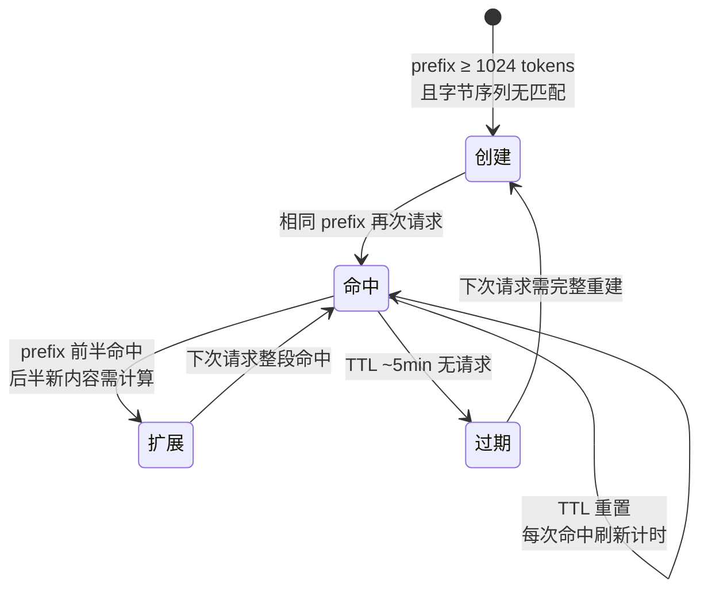
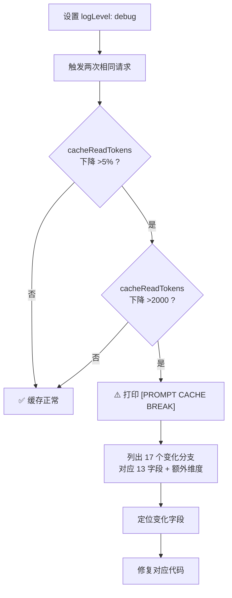
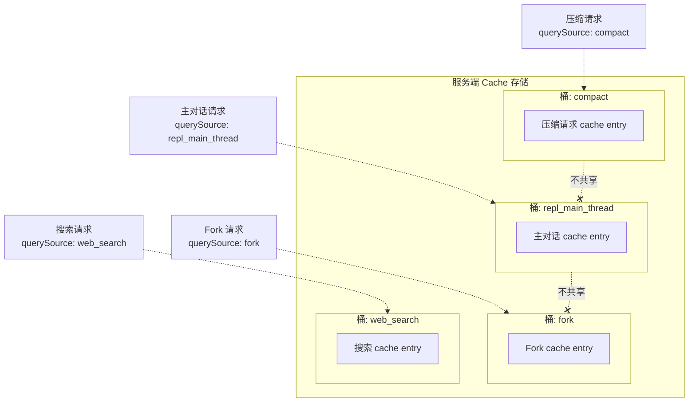
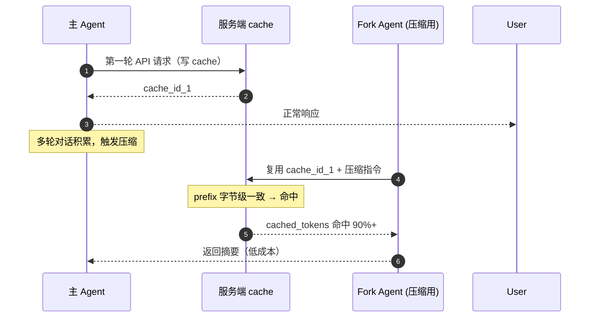
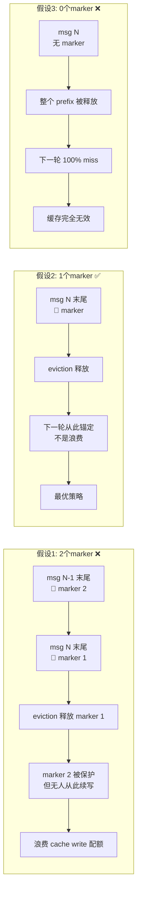
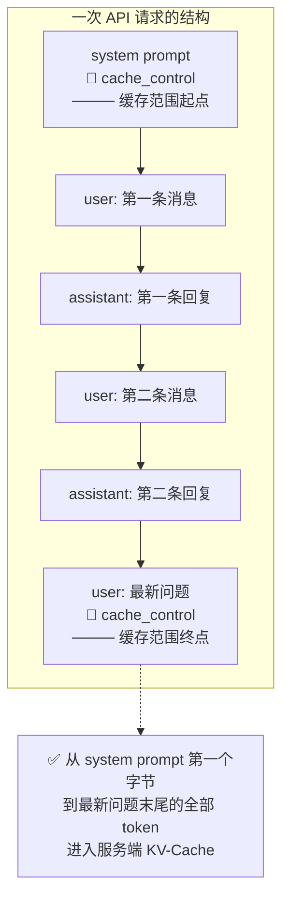
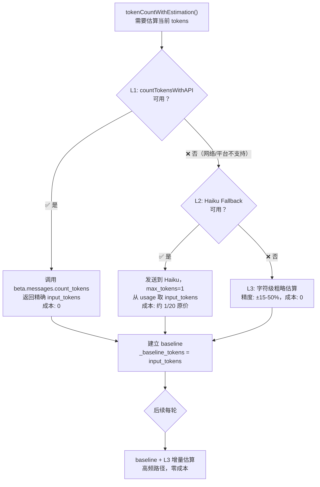

# LLM Prompt Cache 深度解析：原理、机制与实践

> **摘要**：LLM Prompt Cache 通过复用已计算前缀的 KV-Cache，将 Agent 连续对话的推理成本降低 80%+，但命中条件极其苛刻——从请求第一个字节到缓存标记位置的字节序列必须完全一致。本文系统拆解缓存命中机制（Claude Code 的 13 字段 Cache Key 与 4 个硬字段）、Fork 模式如何复用主对话缓存实现 100% 命中率、No-op Merge 与 Exactly One Marker 的底层原理，以及缓存如何彻底改变 Token 估算规则（L1/L2/L3 三层架构）。同时覆盖缓存生命周期、Cache Break 诊断、querySource 分桶隔离、并发 Fork 的 Dense pages 共享机制，并对比 Anthropic / GLM / OpenAI 三家厂商的缓存实现差异，附可操作的跨厂商实践要点。

## 一、引子：GLM-5.1 的 Prompt Cache 实测

主流大模型（Claude、GLM、OpenAI GPT 系列）均已支持 Prompt Cache，但各家行为差异显著。理解缓存的前提是知道它实际存在——先看一次实测。

向智谱 GLM-5.1 发起两次连续请求，第二次的前 10 条 messages 与第一次完全一致：

```bash
# 第一次请求（~3772 tokens 上下文）
curl -X POST "https://open.bigmodel.cn/api/paas/v4/chat/completions" \
  -H "Authorization: Bearer $ZHIPU_API_KEY" \
  -d '{"model":"GLM-5.1","messages":[...10条长消息...]}'

# 第二次请求（同样的前 10 条 + 新增 1 条）
```

结果：

```json
// 第一次
"usage": {
  "prompt_tokens": 3772,
  "prompt_tokens_details": { "cached_tokens": 0 }
}

// 第二次
"usage": {
  "prompt_tokens": 3783,
  "prompt_tokens_details": { "cached_tokens": 3584 }
}
```

**命中率 94.7%**。3584 个 token 从缓存直接读取，按更低的价格计费（通常为原价的 10%）。

这个结果说明了两件事：

1. **GLM-5.1 已内置 Prompt Cache**，与 Claude 一样，响应中通过 `cached_tokens` 字段回报命中量
2. **行为是自动的**——GLM 不需要像 Claude 那样用 `cache_control` 显式标记缓存位置，服务端自动对 prefix 做字节级匹配

验证方法很直接：两次 curl，看 `prompt_tokens_details.cached_tokens` 从 0 变成非零值，就说明缓存生效了。任何支持缓存的模型都可以用同样的方式快速验证。

---

## 二、Prompt Cache 是什么，为什么重要

### 2.1 基本原理

LLM 每次 API 调用都需要"看到"完整的上下文：system prompt + 历史对话 + 当前消息。对于持续对话的 Agent，这个上下文会不断增长。服务端在推理时为输入的 token 序列计算 KV-Cache（Key-Value Cache），存储每个 token 位置的自注意力中间结果。

**Prompt Cache 做的事**：把"不变的 prefix"对应的 KV-Cache 缓存在服务端。下次请求如果 prefix 的字节序列与上次完全相同，就不需要重新计算——直接从缓存读取。

**缓存匹配的是字节序列，不是语义相似**。服务端不会判断"这两段内容意思差不多"，而是逐字节比对。System prompt 改一个空格、工具定义多一个字段、历史消息中某条 reply 不同——从该位置起全部 cache miss。这意味着缓存对 prefix 的字节级稳定性有极高要求。

```
第 N 次 API 调用：
  完整 context = [system(500t)] + [msg1-m10(8000t)] + [新msg(200t)]
                                   ↑ 这部分和上次完全一样
  → 8000t 从缓存读取（低价格或免费）

第 N+1 次 API 调用：
  完整 context = [system(500t)] + [msg1-m10(8000t)] + [msg11(300t)] + [新msg(200t)]
                                   ↑ 上次已经缓存           ↑ 新的，需要计算
  → 8000t 命中缓存 + 500t 新计算
```

### 2.2 为什么 Agent 系统特别需要它

Agent 的对话模式天然适合缓存：

| 特征 | 对缓存的影响 |
|------|----------------|
| System prompt 不变 | 每次请求的 prefix 起点相同 |
| 历史消息只增不删 | 每轮都在上一次 prefix 基础上追加 |
| 工具 schema 不变 | 工具定义恒定 |

一个典型的 Agent 会话，第 20 轮的 prompt 中可能有 90% 以上的内容在第 19 轮已经发过了。没有缓存，每次都要全额计费；有缓存，90% 按低价格计费。

### 2.3 最小触发阈值

Prompt Cache 不是对所有请求都生效——通常有一个**最小触发阈值**，一般要求缓存范围内的 token 数不低于 1024。如果 prefix 太短（比如只有一条 system prompt 加两句对话），服务端不会建立缓存。

这意味着缓存对"有足够长度的重复前缀"才起作用，短对话或者频繁更换 system prompt 的场景无法受益。

**为什么需要阈值？** KV-Cache 的存储和管理有内存开销。对于很短的 prefix（几十到几百 tokens），重新计算的成本低于缓存管理的开销（分配 KV pages、维护索引、TTL 计时等）。因此服务端会设定一个"性价比"门槛，低于门槛的请求静默跳过缓存——不会报错，`cached_tokens` 返回 0，不会建立新的 cache entry。

### 2.4 缓存的生命周期

Prompt Cache 不是永久的，它有明确的生命周期：

| 阶段 | 行为 |
|------|------|
| **创建** | prefix ≥ 阈值 且 字节序列与已有缓存不匹配 → 服务端计算 KV 值并写入新 cache entry（`cache_creation_input_tokens` 记录写入量） |
| **命中** | prefix 字节序列与已有缓存匹配 → 直接从缓存读取（`cache_read_input_tokens` 记录命中量），TTL 计时器重置 |
| **扩展** | prefix 前半部分命中、后半部分新内容 → 命中部分读取，新部分计算并追加到 cache entry（既有 `cache_read` 也有 `cache_creation`） |
| **过期** | TTL 窗口内无请求命中该 entry → 缓存被驱逐，下次相同请求需完整重建 |

**TTL 时长**：通常约 5 分钟，从最后一次命中开始计时。连续对话中，只要每轮间隔不超过 TTL，缓存就一直有效。间隔超过 TTL 后，下一轮请求会出现"看似相同的 messages，cached_tokens 却回到 0"的现象——这是正常的缓存过期，不是 bug。



### 2.5 计费影响

缓存的本质价值在计费上体现得最直接：

| token 类型 | 计费比例（相对于基准价） | 含义 |
|-----------|----------------------|------|
| `prompt_tokens`（常规） | 100% | 全新计算的部分 |
| `cache_read_input_tokens` | ~10% | 从缓存读取的部分 |
| `cache_creation_input_tokens` | ~125% | 写入缓存的部分（写入比读取贵） |

一个典型的 Agent 长对话：第 20 轮 prompt 共 30,000 tokens，其中 27,000 命中缓存（90%）。费用 = 3,000 × 100% + 27,000 × 10% = 5,700 token 等效计费，相比无缓存场景（30,000 × 100%）节省 **81%**。

> 注：具体比例以各厂商官方定价为准，10%/125% 为常见区间值，本文不做定价承诺。

### 2.6 cache_read 的三个维度

`cached_tokens` / `cache_read_input_tokens` 在不同维度含义完全不同。同一个数字在不同语境下是相反的答案：

| 维度 | cache_read 算不算 | 含义 |
|------|------------------|------|
| **Context Window 空间占用** | ✅ 算 | 50K cached + 130K 新 token = 180K 都占上下文空间 |
| **GPU 计算成本** | ❌ 不算 | 50K cached 不需要重新计算 |
| **API 计费账单** | ❌ 不算（或低价） | 免费或按 10% 低价计费 |

**实践意义**：压缩阈值（判断是否触发压缩）看的是"空间占用"维度——手算会高估 10–50%，但因为压缩决策需要安全余量，这种高估是有益的（不会因为低估而漏过压缩时机）。真正受影响的是计费预算——如果把全量 prompt_tokens 当计费基数，会严重高估成本。

---

## 三、Claude Code 的 Cache Key 实现

### 3.1 两层分工

缓存命中不是单靠服务端完成的，Claude Code 的实现是 **client 端 + server 端两层协作**：

```
Client 端（13 字段检测）：
  1. 收集 13 个影响缓存的字段
  2. 计算 hash → 与上一次的 PendingChanges 对比
  3. 记录变化到 cache break detection
  4. 调用 server

Server 端（prefix 字节级匹配）：
  1. 收到请求 → 解析 messages 字节序列
  2. 从第一字节开始匹配已缓存的 KV pages
  3. 匹配到的部分 → 返回 cache_read tokens
  4. 新部分 → 计算并写入 cache_creation tokens
```

### 3.2 13 个字段清单

| # | 字段 | 改了会怎样 |
|---|------|-----------|
| 1 | **system** (rendered system prompt bytes) | 全部 cache miss |
| 2 | **toolSchemas** (工具定义列表) | 全部 cache miss |
| 3 | **querySource** (请求来源) | 全部 cache miss |
| 4 | **model** (模型 ID) | 全部 cache miss |
| 5 | **agentId** (当前 agent 唯一标识) | 全部 cache miss |
| 6 | **fastMode** (快速模式开关) | 全部 cache miss |
| 7 | **globalCacheStrategy** | 全部 cache miss |
| 8 | **betas** (beta 头列表) | 全部 cache miss |
| 9 | **autoModeActive** (自动模式) | 全部 cache miss |
| 10 | **isUsingOverage** (超额使用) | 全部 cache miss |
| 11 | **cachedMCEnabled** (microcompact cache) | 全部 cache miss |
| 12 | **effortValue** (当前 effort 设置) | 全部 cache miss |
| 13 | **extraBodyParams** (max_tokens/output_config/thinking) | 全部 cache miss |

**重要**：`messages` 不在 13 字段里！服务端独立对 messages 的字节序列做 prefix 匹配。

其中几个字段的含义补充：
- **globalCacheStrategy** / **cachedMCEnabled**：microcompact（微压缩）相关的缓存策略开关，控制压缩后的内容是否进入缓存
- **autoModeActive**：Claude Code 的自动模式是否激活
- **betas**：API 的 beta 特性头列表，启用实验性功能时会改变请求特征
- **effortValue**：Claude Code 的 effort 等级设置，影响模型推理深度
- **querySource**：区分请求是来自主对话还是 fork，不同来源可能对应不同缓存策略

**同样重要的是，哪些常见参数不在 13 字段里**：`temperature`、`tool_choice`、`metadata` 都不是 cache-key 的一部分。改 temperature 或加 metadata 不会导致缓存失效。这是 Anthropic 的有意设计——temperature 只影响采样策略不影响 KV 计算，metadata 是纯追踪字段。实践中这意味着可以在 Fork 中安全调低 temperature 而不破坏缓存。

### 3.3 4 个"硬"字段：绝对不能改的 Cache-Key Params

在实际工程中，有些字段在 Fork 场景下看起来"可以调整"，但改了就会导致全部 cache miss。Claude Code 的 PR #18143 是这方面的经典案例：

**硬字段（不能改）**：

| 字段 | 改的后果 | 正确做法 |
|------|---------|---------|
| tools | 全部 fork cache miss | 拒绝工具用 callback，不用空 tools 列表 |
| system | 全部 fork cache miss | 保持 system 一致，在 user message 注入额外指令 |
| thinking | 全部 fork cache miss | 保持 thinking 开启，靠 prompt 要求"快速回答" |
| max_tokens | 全部 fork cache miss | 保持一致，输出长度靠 prompt 限制 |

**软字段（可以改）**：model、betas、querySource、agentId。这些字段改了会创建新 cache entry，但不会破坏已有缓存条目。

### 3.4 Cache Break 诊断机制

Claude Code 内置了一个自动诊断系统——`checkResponseForCacheBreak`。当它检测到缓存命中率异常下降时，会自动触发警告并列出变化字段。

触发条件（双阈值）：

```
cacheReadTokens 下降 > 5%     （相对跌幅）
AND  cacheReadTokens 下降 > 2000 tokens （绝对跌幅）
```

满足双条件时：
- 输出 `[PROMPT CACHE BREAK]` 警告
- 列出 17 个可能的变化分支（对应 13 字段 + 额外检测维度）
- 触发 `logEvent 'tengu_prompt_cache_break'` 上报

**为什么需要这个机制**：缓存失效是静默的——你发了一个请求，正常收到回复，完全不知道缓存没命中，只是在账单上多花钱。有了这个诊断系统，任何显著的缓存退化都会被及时发现。

诊断流程：



### 3.5 querySource 分桶：缓存隔离机制

`querySource` 是 13 字段中的第 3 个字段，但它承担的职责远超"标识请求来源"——它是 **cache 按来源分桶的隔离键**。

Claude Code 使用多种 `querySource` 值来区分请求类型：

| querySource | 含义 | 缓存行为 |
|-------------|------|---------|
| `repl_main_thread` | 主对话线程 | 有自己的独立 cache entry 桶 |
| `compact` | 压缩请求 | 有独立的 cache 桶 |
| `fork` | Fork Agent 请求 | 有独立的 cache 桶 |
| `web_search` | 网页搜索 | 有独立的 cache 桶 |



**关键规则：不同 querySource 的缓存不共享。** 即使 messages 完全相同，`repl_main_thread` 和 `fork` 的 cache entry 是分开的。这意味着：

- Fork 复用主对话缓存的前提是 **querySource 一致**——主对话写 cache 后，fork 必须以相同的 querySource 读，否则完全 miss
- 这解释了为什么"软字段"中单独列出 querySource——改 querySource 虽然不会让已有缓存失效，但会切换到另一个完全不同的缓存桶，效果等同于全量重建
- 不同来源的缓存请求不会互相干扰——压缩请求的大量缓存写入不会 evict 主对话的缓存页

**实践启示**：如果自己实现 Agent 系统并希望使用缓存，需要意识到不是"同样的 messages 就能命中"——请求上下文标识（来源、模型、agent 身份等）也是缓存匹配的一部分。不要把不同用途的请求混在同一个请求标识下，这会降低缓存效率。

---

## 四、Fork 模式：利用缓存降低辅助任务成本

### 4.1 问题

Agent 系统中的压缩（摘要生成）通常需要调 LLM 处理完整对话历史。如果作为独立请求发送，整个 prompt（含完整对话）都需要全额计费。对话越长，压缩成本越高。

### 4.2 解决：Fork Agent 复用缓存

Claude Code 的做法是让压缩跑在一个 "Fork Agent" 里——它**复用**主对话的 cache prefix，只付新增的压缩指令的 token 费。



### 4.3 实测数据

对 Fork 模式与独立请求模式进行对比：

| 指标 | 独立模式 | Fork 模式（复用主对话前缀） |
|------|---------|---------------------------|
| input_tokens | 26,771 | 25,684 |
| cached_tokens | 1,984 | **25,664** |
| 缓存命中率 | 7% | **100%** |

- Fork 模式命中率 100%（25,664 / 25,684）
- 独立模式只有 7% 零散命中（可能来自系统级缓存）

### 4.4 三层保证

Fork 实现通过三层保证字节级一致：

```python
forked_messages = list(parent_messages) + [{"role": "user", "content": prompt}]
chunks = self.llm.chat(
    messages=forked_messages,
    tools=parent_tools,              # 与主对话 tool schema 完全相同
    system_prompt_override=parent_system,  # 与主对话 system prompt 完全相同
    tool_choice="none",              # 禁止调工具
)
```

**验证**：`tool_choice="none"` 不影响缓存命中。实测中，相同 tools 不加 `tool_choice`（cached_tokens=5,952）与相同 tools 加 `tool_choice="none"`（cached_tokens=5,824），差异仅 2.2%，属于正常波动范围。结论：`tool_choice` 字段不是 cache-key 的一部分，可以安全地在 Fork 中设为 `"none"` 以禁止工具调用，而不破坏缓存。

### 4.5 buildForkedMessages：9 条构造规则

Fork 构造消息时不能简单克隆主对话的 messages，Claude Code 的实现中遵循以下 9 条规则：

1. **user message**：原样保留（用于 cache 命中）
2. **assistant text**：原样保留
3. **assistant tool_use**：原样保留
4. **tool_result**：替换为 `FORK_PLACEHOLDER_RESULT`（一个固定的占位字符串常量，详见 §4.6 术语说明；多个并发 fork 用同一常量保证前缀字节级一致，避免异质结果污染缓存）
5. **thinking block**：跳过（thinking 是 LLM 内部状态，不进缓存）
6. **image/document**：占位符替换（避免 base64 字符串差异打破缓存）
7. **progress**：跳过（microCompact progress 标记不传给 fork）
8. **compact_boundary**：跳过（fork 自己重新决定压缩）
9. **compact_summary**：跳过（fork 重新做摘要）

### 4.6 并发 Fork 的缓存共享

> **📌 术语说明（本节三个来源自 Claude Code 源码的专有名词）**
>
> - **`FORK_PLACEHOLDER_RESULT`** — Claude Code 源码中定义的一个**固定字符串常量**（实际值类似 `"Fork started — processing in background"`）。Fork 发起时，第一条 `tool_result` 的内容尚未产生，用这个常量占位，确保多个并发 fork 的前缀字节序列完全一致，从而共享同一份缓存。
> - **Mycro** — Anthropic 服务端的 **KV-Cache 管理系统**代号（名称来源于 "micro-cache" 的缩写）。负责接收 `cache_control` 标记、分配/合并/回收缓存条目，以及执行 turn-to-turn eviction 策略。本文讨论的"恰好 1 个 marker"、"No-op Merge"等行为，都是 Mycro 的既定规则。
> - **Dense pages** — Mycro 内部 **KV-Cache 的存储单元**，类似操作系统内存管理中的"页（page）"。每个 dense page 存储一段连续 token 序列的 KV 计算结果。"Dense" 表示内存布局紧凑连续（相对于 sparse），引用计数（refcount）以 page 为单位管理。

Fork 模式的一个精妙设计在于：它天然支持**多个并发 fork 共享同一份 cache entry**。

关键机制藏在 `FORK_PLACEHOLDER_RESULT` 这个字节级常量里。fork 后的第一条 tool_result 被替换为固定的 placeholder 字符串——多个并发 fork 在执行各自的子任务之前，看到的前缀（system + messages + placeholder）完全一致。服务端 Mycro 系统通过 Dense pages 的**引用计数**（refcounted）来管理这些共享的 KV 页：

```
主对话 API 调用          → 写 cache entry,  Dense pages refcount = 1
Fork A 发起请求（读缓存）  → refcount = 2  （共享同一批 KV 页）
Fork B 发起请求（读缓存）  → refcount = 3  （仍然共享）
Fork A 返回结果            → refcount = 2  （A 释放引用）
Fork B 返回结果            → refcount = 1  （B 释放引用）
缓存过期（TTL 到）         → refcount = 0  → 回收
```

直到引用计数归零，Dense pages 才会被真正回收。这意味着**并发 fork 不会互相污染缓存**——每个 fork 在 placeholder 之后追加自己的 per-child directive（不同的子任务指令），但 cache prefix 到 placeholder 为止是共享区域。fork 之间不同的内容在 placeholder 之后才开始，service 端不会把不同 fork 的尾部写回共享 entry（因为 `skipCacheWrite: true`）。

实际工程中的意义：

- Fork 数量增加不会导致缓存成本线性增长——10 个并发 fork 和 1 个 fork 的缓存读取成本相同（都只付 `cache_read` 的低价）
- 不需要任何显式的"缓存共享"配置——只要保证 prefix 字节级一致（这就是 `FORK_PLACEHOLDER_RESULT` 是常量的原因），共享自动发生

---

## 五、两个重要概念

**No-op Merge 和 Exactly One Marker** 是 Anthropic 服务端 KV-Cache 管理系统（Mycro）的两个核心行为规则。理解它们，才能解释：为什么添加 `cache_control` 标记不一定触发"写入"、为什么 marker 的数量有严格限制、以及为什么 Fork 模式能实现"零写入复用"。

### 5.1 No-op Merge

**No-op Merge（无操作合并）** 是指：当服务端检测到 `cache_control` 标记的位置**已经存在**对应的 cache entry 时，不分配新的 KV 页，而是将标记"合并"到已有 entry 上。从调用方的视角看，这是一次"无操作"——没有新的缓存写入发生。

> **📜 原文注释**（Claude Code 源码 `claude.ts:3084-3089`）
> ```
> There should be exactly one message-level cache_control marker per request.
> The reason is that Mycro's turn-to-turn eviction frees any KV pages at any
> cached prefix position NOT in cache_store_int_token_boundaries.
>
> For fire-and-forget forks (skipCacheWrite), we shift the marker to the
> second-to-last message so the write is a no-op merge on mycro (entry already
> exists) and the fork doesn't leave its own tail in the KVCC.
> Dense pages are refcounted and survive via the new hash either way.
> ```

**No-op Merge 的 3 层含义**：

| 层次 | 含义 |
|------|------|
| **字面含义** | client 在已有 cache 的位置发 `cache_control` 标记时，server 不写新数据 |
| **行为表现** | API 响应中 `cache_creation_input_tokens ≈ 0`，`cache_read_input_tokens = 已有 entry 的 token 数` |
| **资源动作** | Mycro 在 `cache_store_int_token_boundaries` 中**合并**新标记到已有 entry，**不分配**新 KV pages。Dense pages 引用计数（refcounted）保持稳定 |

**3 个常见误解**：

| 误解 | 正确理解 |
|------|---------|
| ❌ "no-op merge" = "什么都不做" | ✅ "no-op merge" = "merge 到已有 entry"（不是真正的 no-op） |
| ❌ "entry already exists" = "hash 相同" | ✅ "entry already exists" = "cache 位置前缀已建过"（不依赖 hash 比较） |
| ❌ "Dense pages 受影响" | ✅ Dense pages 引用计数以 page 为单位，不受 cache 边界变化影响 |

`no-op merge on mycro (entry already exists)` 这句话容易被误解为"什么都不做"。它的实际含义是：

**client 在已有缓存的位置发 `cache_control` 标记时，服务端不分配新 KV pages，而是把新标记合并到已有 cache entry。**

三种缓存行为对比：

| 行为 | cache_creation | cache_read | 含义 |
|------|---------------|-----------|------|
| No-op merge | ≈ 0 | = 已有 entry 大小 | 服务端已有 entry，合并标记 |
| Partly write | > 0（部分） | 增量 | 服务端已有部分，扩展新位置 |
| Full write | = 全量 | 0 | 服务端没有 entry，完整新建 |

**触发场景**：No-op Merge 最常出现在 Fork 复用主对话 prefix 时——Fork 在已有缓存的位置重复发送 `cache_control` 标记。服务端检测到"这个位置的 KV 页已经存在"，跳过分配新页，直接把标记合并到已有 entry。这就是为什么 Fork 能高效复用缓存——它不需要重复写入，只做一次轻量的元数据合并。

Fork 路径使用 `skipCacheWrite=true`，确保 fork 不创建新 cache entry，只做 no-op merge。

Claude Code 中 `skipCacheWrite: true` 实际在 **3 个不同场景**中被使用：

| 调用方 | 文件 | 场景 | 为什么 skip |
|--------|------|------|------------|
| **sideQuestion** | `utils/sideQuestion.ts:95` | Fork 侧问——从主对话分叉执行独立查询 | 复用主对话缓存，不污染 parent 的 cache entry |
| **awaySummary** | `utils/awaySummary.ts:56` | 离开摘要——用户切换到其他窗口时自动生成会话摘要 | 一次性后台任务，不需要持久化到主对话的缓存 |
| **PromptSuggestion** | `tools/PromptSuggestion/promptSuggestion.ts:329` | 提示建议——自动生成后续对话的建议 | 纯辅助功能，生成的 cache 对主对话没有后续复用价值 |

三种场景的共同特征：都是"辅助任务"——从主对话读取上下文、产生一次性结果、结果不需要写回主对话的缓存。如果不用 `skipCacheWrite`，每次辅助任务都会在服务端留下一个孤立的 cache entry，不仅浪费 KV 页配额，还可能在 eviction 时误伤主对话的缓存。

这解释了为什么"恰好 1 个 marker + skipCacheWrite"是 Fork 缓存策略的完整拼图——marker 控制缓存写入位置，skipCacheWrite 控制是否写入。二者配合，辅助任务才能高效复用缓存而不造成副作用。

### 5.2 Exactly One Marker

> **📜 原文注释**（Claude Code 源码 `claude.ts:3084-3089`，Exactly One Marker 的权威解释）
> ```
> There should be exactly one message-level cache_control marker per request.
> The reason is that Mycro's turn-to-turn eviction frees any KV pages at any
> cached prefix position NOT in cache_store_int_token_boundaries.
>
> With two markers (say at the last position and second-to-last), the
> second-to-last position is "protected" — it gets evicted immediately, but
> the system will need to recreate it next turn, which is wasted work for a
> position nothing will ever resume from.
>
> With one marker, it's freed immediately and will be re-anchored next turn.
>
> With zero markers, the entire prefix gets evicted — 100% cache miss next turn.
> ```

Anthropic 的 KV Cache 管理系统（Mycro）要求**恰好 1 个** `cache_control` marker。这不是建议而是硬约束。

**Exactly One Marker 的 3 层含义**：

| 层次 | 含义 |
|------|------|
| **字面含义** | Mycro 的 `cache_store_int_token_boundaries` 只跟踪 1 个 marker 位置，turn-to-turn eviction 只保护这 1 个位置 |
| **行为表现** | 1 个 marker → 最优缓存命中；2 个 → 倒数第二位置被保护但无人续写，浪费 cache write 配额；0 个 → 整个 prefix 被释放，下一轮 100% miss |
| **资源动作** | Mycro 在 eviction 时，只保留 `cache_store_int_token_boundaries` 中的这 1 个位置的 KV pages，其余全部释放 |

**3 个常见误解**：

| 误解 | 正确理解 |
|------|---------|
| ❌ "exactly one" = "最多一个" | ✅ "exactly one" = "恰好一个"（0 个也不行，会导致 100% miss） |
| ❌ "marker 放在哪都一样" | ✅ 位置决定 cache 边界；Fork 必须 shift 到倒数第二，否则 fork directive 会浪费 cache 配额 |
| ❌ "多个 marker 都会生效" | ✅ 只有最后 1 个 marker 生效；前面的 marker 所在位置被保护但永远不会被续写，纯浪费 |

上述注释完整论证了为什么是"恰好 1 个"：

**为什么恰好 1 个——三种假设的论证**：



**位置规则**：

- 正常请求：marker 放在最后一条消息
- Fork 请求（skipCacheWrite=true）：marker 放在倒数第二条消息

**为什么 Fork 用倒数第二**：Fork 在末尾追加了自己的 "fork directive" 消息。这条消息不会进主对话的缓存。如果 marker 在最后，cache write 会包含 fork directive（浪费配额）。移到倒数第二，fork directive 不进 KV-Cache。

**cache_control 标记的 API 写法**：在 content block 上加 `"cache_control": {"type": "ephemeral"}`。标记位置之前的所有内容（从请求开头到标记所在 block 末尾）将被服务端缓存。

```json
{
  "model": "claude-sonnet-4-20250514",
  "system": [
    {
      "type": "text",
      "text": "你是一个乐于助人的助手。以下是系统配置：...（长 system prompt）",
      "cache_control": { "type": "ephemeral" }
    }
  ],
  "messages": [
    {"role": "user", "content": "第一条用户消息..."},
    {"role": "assistant", "content": "第一条助手回复..."},
    {"role": "user", "content": "第二条用户消息..."},
    {"role": "assistant", "content": "第二条助手回复..."},
    {
      "role": "user",
      "content": [
        {
          "type": "text",
          "text": "第三条用户消息，也是本轮最新问题",
          "cache_control": { "type": "ephemeral" }
        }
      ]
    }
  ]
}
```



几个关键点：

- **标记在 content block 级别**，不是 message 级别。user/assistant 消息如果 content 是多 block 数组，只标记最后一个 block
- **标记位置**决定了缓存范围：从请求的第一个字节到标记所在 block 的末尾，这部分全部进入缓存
- **只有 1 个**：如果放了多个标记，只有最后一个生效，前面的被忽略
- **ephemeral** 表示缓存是临时的（TTL ~5 分钟），不持久化

> **📜 核心教训**（Exactly One Marker）
> **Exactly one** 是 Mycro 的硬约束，不是建议。**位置**决定了 cache 行为（最后/倒数第二）。Fork 路径的"shift to second-to-last"是为了**避免浪费 cache write 配额**，不是"避免污染"。

### 5.3 不同厂商的缓存实现差异

并非所有模型的 Prompt Cache 行为一致。前面讨论的 No-op Merge、cache_creation/cache_read 分桶、Exactly One Marker 等机制，前提是服务端提供精细的缓存控制。

以 GLM 系列为例，其缓存实现是简化版：能命中（`cached_tokens > 0`），但**不返回** `cache_creation` / `cache_read` 分桶信息，全部合并到统一的 `prompt_tokens` 字段中。这意味着：

- 无法区分是 No-op Merge、Partly Write 还是 Full Write
- 命中率只能粗略用 `cached_tokens / prompt_tokens` 估算
- cache_control marker 的精细控制（如恰好 1 个、skipCacheWrite 等）被简化处理

这并非缺陷——不同厂商选择不同的抽象层次。理解差异的意义在于：**当你看到缓存行为与预期不符时，先确认对方 API 的缓存实现层次**。Anthropic 提供了最精细的控制（Mycro + 13 字段 + 分桶响应），其他厂商可能在简洁性和可控性之间做了不同取舍。

---

## 六、缓存对 Token 估算的影响

### 6.1 核心问题

手算的 token 数 ≠ API 实际计费的 token 数。

原因是缓存命中。`cache_read_input_tokens` 是从 KV-Cache 读取的部分——它占据了 context window 空间（占位），但 API 按低价格或免费计费。手算会重复计算这部分，导致**高估 10–50%**。

### 6.2 Claude Code 的三层 Token 估算架构

`tokenCountWithEstimation()` 是顶层入口，但 Claude Code 实际有三层估算体系，按精度和成本从高到低排列：

| 层级 | 函数 | 原理 | 精度 | 成本 | 使用场景 |
|------|------|------|------|------|---------|
| **L1** | `countTokensWithAPI()` | Anthropic 专用计数 API（`beta.messages.count_tokens`），不消耗输出 tokens | 精确 | 零费用 | 压缩前精确判断是否需要触发 |
| **L2** | `countTokensViaHaikuFallback()` | 用 Haiku（低成本模型）发完整请求，从 `usage` 取 input_tokens | 精确 | Haiku 价格（约 Sonnet 的 1/20） | L1 失败时的降级方案 |
| **L3** | `roughTokenCountEstimation()` | 字符级粗略估算：英文 ~4 字符/token，JSON ~2 字符/token，图片固定 2000 | ±15–50% | 零费用 | 高频阈值检查，每轮都调用 |



**L1 是首选**——Anthropic 的 `count_tokens` 端点专为计费前精确计数设计，只返 `input_tokens`，不产生任何输出 tokens，完全免费。

**L2 是安全网**——当 L1 因网络错误或平台不支持（如 Bedrock/Vertex 的部分配置）而不可用时，降级到 Haiku。`max_tokens: 1` 确保几乎不产生输出费用。

**L3 是高频路径**——压缩阈值检查发生在每轮对话中，不能每次都调 API。L3 用字符数除以经验系数快速估算。数据表明对于英文和 JSON 偏差可控，但对中文和混合内容可能出现较大偏差。

三层共同支撑 `tokenCountWithEstimation()` 的增量估算逻辑：

```
当前上下文大小 ≈
  上次 API 响应的 input_tokens（权威数字，L1/L2 提供）
  + 上次响应之后新增消息的 L3 粗略估算
```

```python
def _estimate_used_tokens(self, messages):
    msg_count = len(messages)
    if self._baseline_valid and self._baseline_msg_count <= msg_count:
        # 增量路径：基准 + 新消息估算
        new_messages = messages[self._baseline_msg_count:]
        estimated_new = self.token_counter.count_messages(new_messages)
        return self._baseline_tokens + estimated_new
    # 全量兜底
    return self.token_counter.count_messages(messages)
```

### 6.3 缓存如何影响压缩触发

Claude Code 中观察到的一个实际问题——Agent 进程重启后 Token "跳变"：

```
重启前（增量路径）：64,967 tokens（从上次 API 响应恢复的 input_tokens，已正确扣除缓存部分）
重启后（全量路径）：90,268 tokens（baseline 丢失，回退到手算累加，不计缓存命中）
差额：28%
```

原因：Agent 进程重启或会话从磁盘重建时，内存中的 `_baseline_tokens` / `_baseline_msg_count` 丢失，Token 估算被迫从"增量路径"切回"全量手算路径"。全量手算不知道哪些 token 会被缓存命中，按全额计——于是同一批消息，重启前算 64,967，重启后算 90,268。

后果：64,967 不触发压缩（远低于阈值），但 90,268 会触发 → 重启后无端触发一次压缩，浪费算力。

**修复方案**：把每次 API 响应的 `chunk.usage.input_tokens` 和对应的 `msg_count` 持久化到会话存储（如 SQLite 或 JSONL）。Agent 重建时按以下步骤恢复：

```python
# 重建时从持久化存储恢复 baseline
saved = load_last_usage(session_id)  # 从 SQLite 读取
if saved and saved["msg_count"] <= len(current_messages):
    self._baseline_tokens = saved["input_tokens"]
    self._baseline_msg_count = saved["msg_count"]
    self._baseline_valid = True
    # 增量估算路径立即可用，无需等待下一轮 API 调用
```

核心思想：缓存是服务端的隐式状态，客户端无法精确知道哪些 token 会被缓存。但可以通过持久化 API 返回的权威 `input_tokens` 值，让"增量估算"在进程重启后仍然有效。


## 七、总结

### 原理：缓存凭什么省钱

| 核心认知 | 一句话 |
|---------|-------|
| 命中前提是字节级一致 | 不是"内容相似"——system prompt 改一个空格，从该位置起全部 miss |
| 缓存有最小触发阈值 | 前缀需 ≥ 1024 tokens 才激活，短对话场景不受益 |
| 生命周期按 TTL 管理 | 创建 → 命中（TTL 刷新）→ 扩展 → 过期（~5 分钟无访问），过期后下次请求静默重建 |
| 计费模型：读便宜、写略贵 | cache_read 按原价 ~10%，cache_write 按原价 ~125%，连续命中可节省 80%+ 的 prompt 成本 |

### 机制：缓存如何被判定为"同一个请求"

| 核心认知 | 一句话 |
|---------|-------|
| 13 字段 Cache Key | client 端对 13 个字段做 fastHash，server 端对 messages 做 prefix 字节匹配 |
| 4 个硬字段绝对不能改 | tools / system / thinking / max_tokens——改其中任何一个，从改动位置起全部 miss |
| temperature / tool_choice 不在 cache key 里 | 改 temperature 或 tool_choice 不影响缓存命中，可放心调整 |
| No-op Merge ≠ 无操作 | 是"合并到已有 cache entry"，不分配新 KV page，cache_write 为零 |
| cache_control marker 恰好 1 个 | Mycro eviction 机制要求：正常请求放最后一条消息，Fork 请求放倒数第二条（skipCacheWrite） |
| 不同厂商实现有差异 | Claude 需显式 marker、GLM 不返 cache_creation/cache_read 分桶信息——跨厂商调试需注意 |

### 实践：如何把缓存用到极致

| 核心认知 | 一句话 |
|---------|-------|
| Fork 模式是缓存复用的最佳实践 | 复用主对话 prefix，压缩等辅助任务成本降 ~90%；注意 cold start 首次反而更贵 |
| 并发 Fork 通过 Dense pages refcounted 共享 | 引用计数归零才回收，多 fork 并发不会互相污染缓存 |
| querySource 分桶隔离 | 主对话 / fork / compact / web_search 各有独立缓存桶，互不共享 |
| 缓存彻底改变 Token 估算规则 | 手算偏高 10–50%，正确做法：API 返回的 input_tokens 作 baseline + 每轮增量估算 |
| Cache Break 双阈值诊断 | cacheReadTokens 相对下降 >5% 且绝对下降 >2000 → 触发警告，逐字段定位变化点 |
