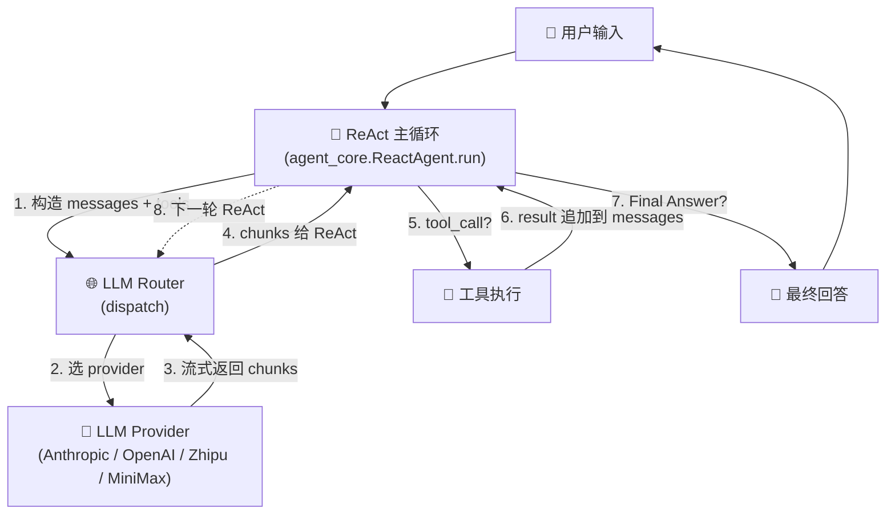
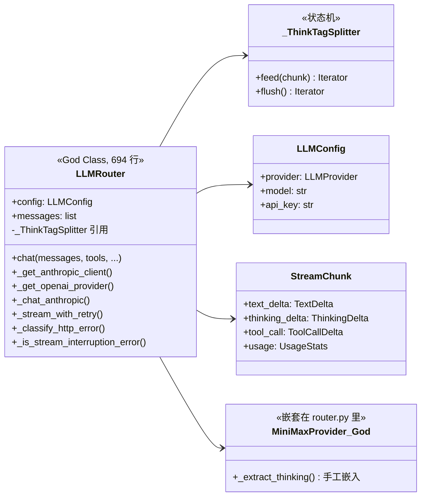
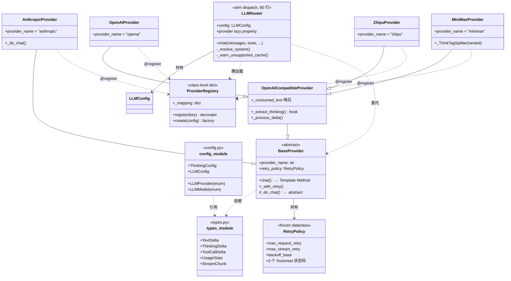
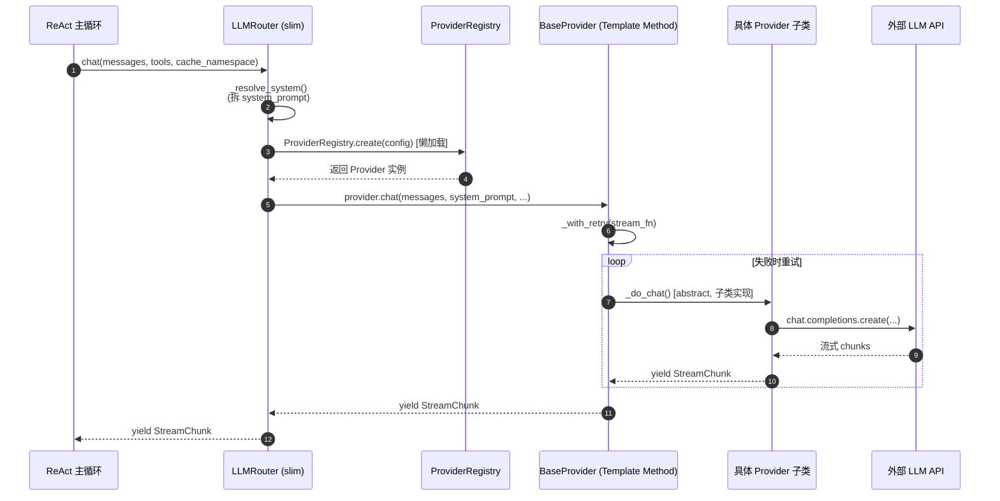
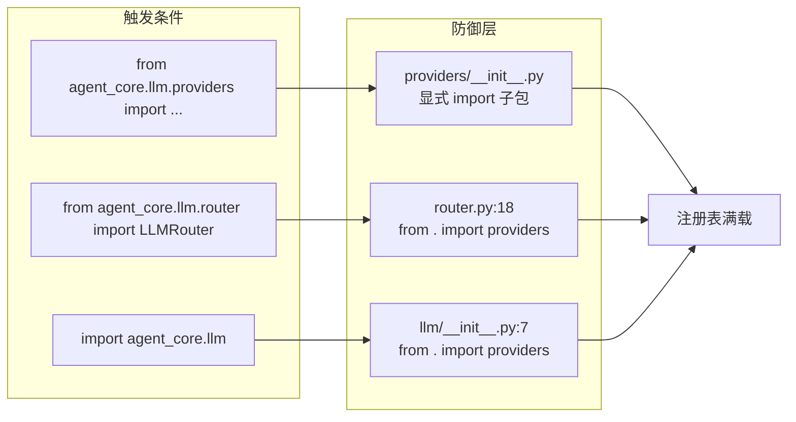

# LLM Router 重构 — 架构变化图解

> 整理时间：2026-06-29
> 配套设计文档：[llm-router-architecture-redesign.md](llm-router-architecture-redesign.md)
>
> 本文用图示对比 LLM Router 重构 **前 / 后** 的架构差异,以及它在 ReAct 循环中扮演的角色。

---

## 一、ReAct 循环中的位置(上下文)

LLM Router 是 ReAct 主循环里 **"调 LLM"** 这一步的抽象入口。每次 `Thought → Action → Observation` 都走它一次。



**Router 的职责边界**:只做"分诊 + 转交"——把 system_prompt 拆出来、警告不支持的 cache 命名空间、然后把请求扔给具体 Provider。**重试 / 协议解析 / thinking 提取 / 流式循环** 全部在 Provider 里。

---

## 二、重构前(Before)— 上帝类

### 2.1 文件结构(2 个文件撑起 1000+ 行)

```
agent_core/llm/
├── router.py              ← 694 行"上帝类",啥都在这里
│   ├── 数据类型:TextDelta / ThinkingDelta / ToolCallDelta / UsageStats / StreamChunk
│   ├── 配置:LLMConfig / LLMProvider / LLMModel / ThinkingConfig / MODELS_BY_PROVIDER
│   ├── 重试常量 + 重试逻辑:_stream_with_retry / _classify_http_error
│   ├── Anthropic 协议:_chat_anthropic()
│   ├── OpenAI 兼容:_get_openai_provider() / OpenAIProvider / MiniMaxProvider / ZhipuProvider
│   ├── 思考拆分:_ThinkTagSplitter
│   └── Backward-compat re-exports(24 个外部文件 import 入口)
└── thinking_splitter.py   ← 79 行,被 router.py 引入
```

### 2.2 类与依赖关系



### 2.3 痛点

| 痛点 | 表现 |
|---|---|
| **SRP 违反** | 1 个文件 5 种职责(数据/配置/重试/协议/分发) |
| **OCP 违反** | 加第 4 个 OpenAI 兼容 provider 要改 router.py 的 `if/elif` 链 |
| **测试困难** | 694 行耦合在一起,只能整体 mock,不能针对协议单元测 |
| **复用受限** | 想在 router 之外的地方调 Anthropic 协议?做不到 |
| **重试策略不灵活** | 所有 provider 共用同一份 retry 策略 |

---

## 三、重构后(After)— 分层架构

### 3.1 文件结构(10 个文件,职责单一)

```
agent_core/llm/
├── types.py                (173 行) 纯数据:StreamChunk / TextDelta / ... / UsageStats
├── config.py               (123 行) 配置:LLMConfig / LLMProvider enum / MODELS_BY_PROVIDER
├── registry.py             (78 行)  注册表:ProviderRegistry + @register_provider 装饰器
├── router.py               (157 行) 瘦身后的 dispatch,只做 system_prompt 处理 + 转发
├── __init__.py             (29 行)  触发 @register_provider 副作用,re-export 公共 API
└── providers/
    ├── __init__.py         (17 行)  ⚠️ 触发 anthropic/openai 子包 import(防 sys.modules 缓存)
    ├── base.py             (122 行) BaseProvider(ABC) — Template Method 框架
    ├── _retry.py           (216 行) RetryPolicy 数据类 + retry_stream() 工具
    ├── anthropic/
    │   ├── __init__.py     (1 行)
    │   └── base.py         AnthropicProvider — 协议实现
    └── openai/
        ├── __init__.py     re-export 4 个类
        ├── base.py         OpenAICompatibleProvider — 共享流式逻辑 + _extract_thinking hook
        ├── openai.py       OpenAIProvider
        ├── zhipu.py        ZhipuProvider
        └── minimax.py      MiniMaxProvider — 嵌套 _ThinkTagSplitter(YAGNI)
```

### 3.2 完整类图(分层 + 关系)



### 3.3 调用流(从 ReAct 到具体协议)



---

## 四、设计模式映射(SOLID 落地)

| 模式 | 落地位置 | 解决什么 |
|---|---|---|
| **Template Method** | `BaseProvider.chat()` 包裹 `_do_chat()` | 子类只写协议,重试统一在父类 |
| **Strategy** | `_extract_thinking(delta)` hook | 4 个 OpenAI 兼容 provider 共享流式循环,只换 thinking 提取策略 |
| **Registry** | `@ProviderRegistry.register(...)` 装饰器 | 加 provider = 加 1 个文件,不改 router |
| **Sentinel** | `_consumed_text` 标志位 | 防止 splitter 吃掉的 `<think>` 漏到 text 流 |
| **Forward Ref** | `retry_policy: Optional["RetryPolicy"]` 字符串引用 | 打破 config ↔ providers 循环依赖 |

---

## 五、对比一览

### 5.1 职责拆分

| 维度 | 重构前 | 重构后 |
|---|---|---|
| **文件数** | 2(router.py + thinking_splitter.py) | 10(types/config/registry/router + 6 providers) |
| **router.py 行数** | **694** | **157**(缩 77%) |
| **单一职责** | ❌ 5 个职责挤一起 | ✅ 每个文件 1 个职责 |
| **添加 provider 成本** | 改 3 个文件(router.py + openai_compatible.py + 测试) | **改 1 个文件**(`providers/openai/<name>.py`) |
| **测试粒度** | 整体 mock 694 行 god class | 单元测 RetryPolicy / 单元测 Splitter / mock 单个 provider |
| **向后兼容** | — | ✅ router.py re-export 11 个符号,24 个外部文件零修改 |

### 5.2 防御性设计



**3 道防线**确保 `ProviderRegistry._mapping` 在任何 import 路径下都被填充,避免 `sys.modules` 缓存命中修复前的空 `__init__.py`(这是 10:03:27 错误的根因)。

---

## 六、关键不变量(必须保住)

| 不变量 | 守护代码 |
|---|---|
| **`<think>` 不漏到 text 流** | `MiniMaxProvider._consumed_text` 哨兵 + `_process_delta` 检查 |
| **system_prompt 字节级稳定**(Fork 模式 cache prefix 对齐) | `_resolve_system` 过滤 + `system_prompt_override` 顶层 |
| **重试策略不耦合 env** | `RetryPolicy` 是 frozen dataclass,`__init__` 懒读 env |
| **API 真实数字 > 字面估算** | `_last_turn_usage` 缓存 + `_restore_usage_baseline` 恢复 |
| **idempotent 注册** | `__qualname__ + __module__` 比较,reload 不会双注册 |

---

## 七、加新 Provider 的工作流(对比)

### Before
```
1. 在 router.py 里加 if/elif 分支          (改 god class)
2. 在 openai_compatible.py 里加新类         (改共享文件)
3. 补 thinking_splitter 适配(如果需要)     (改另一个文件)
4. 修测试 mock 的 5 个 patch 点              (改测试)
```
**4 个文件,3 处 if/elif 容易漏**

### After
```
1. 新建 providers/openai/<name>.py         (1 个文件)
2. 写 @ProviderRegistry.register(...)      (1 行装饰器)
3. 实现 _do_chat() / _extract_thinking()    (协议 + thinking)
4. 测试用 monkeypatch ProviderRegistry.create (稳定锚点)
```
**1 个新文件 + 1 行装饰器,无需改 router**

---

## 八、invoke() 收归 — 同步聚合调用的统一抽象

> 落地时间:2026-06-29
> 设计文档:[llm-invoke-retry-design.md](llm-invoke-retry-design.md)

LLM Router 重构解决的是 **流式调用** 的架构问题(ReAct 主循环每次都走流式)。但 5 个非流式调用点(memory 子系统)各自实现了一套重复的"chunk 聚合 + 重试 + 超时 + 空响应检测"模板代码。**invoke()** 把这套模式收归到 Router 上,5 个调用点瘦身到 1 行调用 + 1 个 `on_failure` 闭包。

### 8.1 痛点(迁移前 5 个调用点的样板代码)

| 调用点 | 旧实现的核心模式 |
|---|---|
| `retriever.py::_call_side_query` | 9 行 chunk 聚合 + try/except JSON 解析 |
| `extraction_gate.py::_call_llm` + `_do_llm_call` | ThreadPoolExecutor 超时 + chunk 聚合(2 个方法) |
| `sm_callback.py::_callback` | 13 行 for/except/重试/退避循环 |
| `dedup.py::judge()` | chunk 聚合 + JSON 解析 + 失败放行 |
| `distill_callback.py::_callback` | 跟 sm_callback 完全相同的 13 行重试循环 |

**重复的部分**:chunk 聚合 / 重试 / 退避 / 超时 / 空响应检测 — 5 处重写。

### 8.2 invoke() 的设计契约

```python
def invoke(
    self,
    messages: list[dict],
    *,
    max_retries: int = 2,                       # 总尝试 = max_retries + 1
    timeout: Optional[float] = 30.0,            # 单次超时(None = 禁用)
    on_failure: Optional[Callable[[Exception], str]] = None,  # 失败回调:返降级文本 / raise 穿透
    **kwargs,                                   # 透传 cache_namespace 等
) -> str:                                       # 聚合后的纯文本
```

**两个内部约定**:
- `EmptyResponseError` — invoke() 视空响应为错误,自动触发重试
- `InvokeTimeoutError` — invoke() 内部捕获 `concurrent.futures.TimeoutError` 后包成这个,`on_failure` 可识别并决定怎么降级

### 8.3 调用方迁移对比(瘦身效果)

| 调用点 | 迁移前 | 迁移后 | on_failure 策略 |
|---|---|---|---|
| retriever | 9 行 chunk 聚合 | `text = self.llm_router.invoke(..., on_failure=lambda e: "[]")` | 返 `"[]"` 走 JSON 解析失败兜底 |
| extraction_gate | `_call_llm` + `_do_llm_call`(2 个方法) | 1 个方法,invoke + `max_retries=0` | `InvokeTimeoutError` → 转抛 `LatencyTimeout`(穿透给上层);其他 → 返降级 JSON |
| sm_callback | 13 行 for/except/retry/backoff | invoke + on_failure 闭包 | `"return_empty"` → 返 `""`;默认 → 转抛 `RuntimeError` |
| dedup | chunk 聚合 + 失败放行 | invoke + on_failure 返 `"[]"` | 走 JSON 解析失败 → 返 False(不当重复) |
| distill_callback | 同 sm_callback 13 行 | 同 sm_callback | 同 sm_callback |

### 8.4 架构图(invoke() 在系统中的位置)

```mermaid
flowchart LR
    subgraph "5 个调用点(已统一)"
        A1[retriever._call_side_query]
        A2[extraction_gate._call_llm]
        A3[sm_callback._callback]
        A4[dedup.judge]
        A5[distill_callback._callback]
    end

    subgraph "Router.invoke()(收归)"
        R0["messages + max_retries + timeout<br/>+ on_failure + cache_namespace"]
        R1["_aggregate_chunks<br/>流 → str"]
        R2["超时守卫<br/>ThreadPoolExecutor"]
        R3["空响应检测<br/>EmptyResponseError"]
        R4["指数退避<br/>0.5s × 2^attempt"]
    end

    subgraph "Router.chat()(原流式路径)"
        C0[ReAct 主循环]
    end

    subgraph "Provider(不变)"
        P[provider.chat 流式]
    end

    A1 --> R0
    A2 --> R0
    A3 --> R0
    A4 --> R0
    A5 --> R0
    R0 --> R1
    R0 --> R2
    R0 --> R3
    R0 --> R4
    R1 --> P
    C0 --> P

    R0 -. "on_failure 闭包<br/>决定降级策略" .-> A1
    R0 -. .-> A2
    R0 -. .-> A3
    R0 -. .-> A4
    R0 -. .-> A5
```

### 8.5 on_failure 模式分类(各调用点的降级策略表)

| on_failure 行为 | 适用调用点 | 语义 |
|---|---|---|
| **返非法 JSON**(`"[]"` / `"{}"`) | retriever / dedup | 让下游 JSON 解析自然失败,落到各模块已有的兜底分支(放行 / 降级决策) |
| **返降级 JSON**(`{"should_extract": False, "reason": "..."}``) | extraction_gate(非超时错误) | 给业务层一个明确的"未提取"理由 |
| **转抛领域异常**(`LatencyTimeout` / `RuntimeError`) | extraction_gate(超时) / sm_callback / distill_callback | 把 invoke() 内部错误类型映射回业务层原有异常 |
| **返空字符串**(`""`) | sm_callback / distill_callback(`on_failure="return_empty"` 模式) | 让业务层的 fallback 路径接管 |

**关键设计**:`on_failure` 是 **回调而不是策略枚举**,这样每种业务都能用自己的领域异常 / 降级文本,无需 invoke() 知道所有错误类型。

### 8.6 测试桩更新(FakeLLMRouter 系列)

5 个测试文件都用了类似的 mock 模式。迁移后统一为:

```python
def _make_router(chunks_or_side_effect):
    router = MagicMock()
    def fake_chat(messages, **kw):
        ...
    def fake_invoke(messages, *, cache_namespace=None, **kwargs):
        """invoke() 走与 chat() 相同路径 — 测试用 stub"""
        chunks = list(fake_chat(messages, cache_namespace=cache_namespace, **kwargs))
        return "".join(
            getattr(c.text_delta, "text", None) or ""
            for c in chunks
            if c.text_delta is not None
        )
    router.chat = fake_chat
    router.invoke = fake_invoke
    return router
```

这样调用点改用 `router.invoke(...)` 后,测试桩行为保持一致 — 无需额外改 fake 行为。

### 8.7 收益

| 指标 | 迁移前 | 迁移后 |
|---|---|---|
| 5 个调用点总行数 | 约 100 行(含重复模板) | 约 35 行(只剩 `on_failure` 闭包) |
| 重试 / 超时 / 空响应逻辑副本数 | 5 份独立实现 | **1 份**(Router.invoke() 内) |
| 改重试策略 / 超时时 | 改 5 处 | **改 1 处** |
| 新增第 6 个调用点 | 复制粘贴 13 行模板 | 1 行 `router.invoke(..., on_failure=...)` |

### 8.8 不变量(跟 Router 重构共享)

| 不变量 | 守护点 |
|---|---|
| **chat() 流式路径不变** | invoke() 走的是 `_aggregate_chunks` → `self.provider.chat()`,跟原流式调用完全一致 |
| **on_failure raise 穿透语义** | invoke() 内部 `return on_failure(last_err)` — 闭包 raise 时自然向上抛 |
| **chunk 聚合结果跟原手写代码一致** | `_aggregate_chunks` 只取 `chunk.text_delta.text`,忽略 thinking/tool_call,与各调用点原逻辑一致 |
| **超时语义不变** | ThreadPoolExecutor + future.result(timeout=N) — 跟 extraction_gate 原实现同款 |
